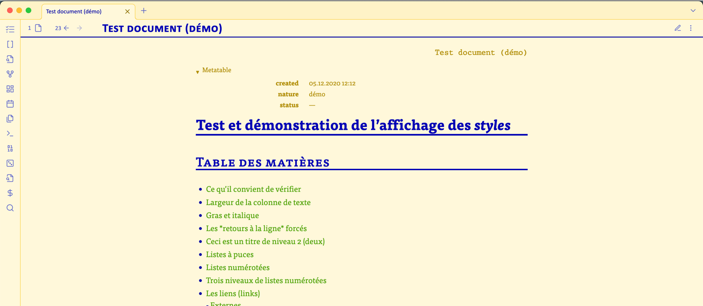
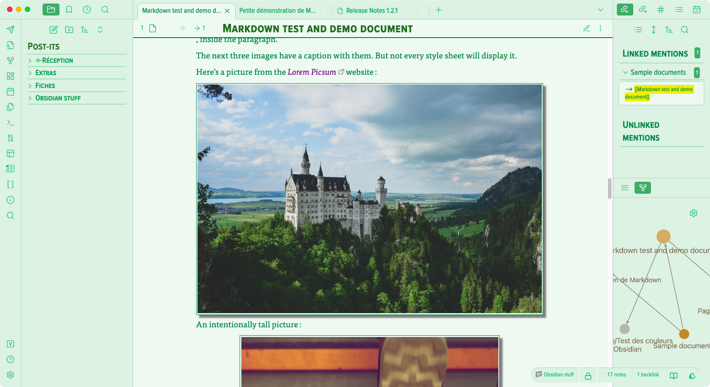
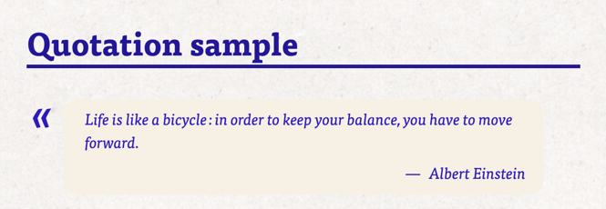
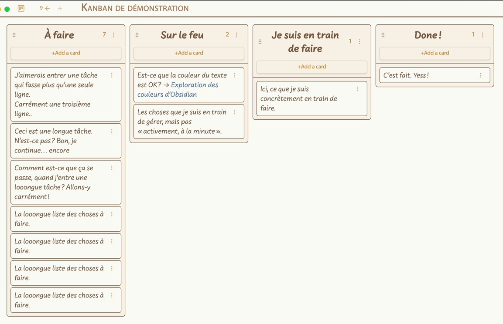

# Olivier’s Theme
*(→ [full User Guide](https://www.craft.do/s/eBDEU8fdQxIUU3))*
*(→ [more samples](https://www.craft.do/s/lxIz4vNEeoXAqc))*
*(→ [updates' description](https://www.craft.me/s/YhSmt2Uz68ERCj))*

An advanced interface theme for styling [*Obsidian*](https://obsidian.md/)’s interface. Its main points are :

- legibility — achieved through…
- close attention to typography and…
- simplicity, yet…
- highly customizable ; but not in a “crazy” way, rather with…
- rich options with a…
- logical and hierarchical organization.
- Careful attention to details.
- Aesthetically pleasant — to each one his own tastes, but the variety of options should bring joy to the eyes of many.
- The provided options are meant to make sense for many scenarios and use cases.
- Consulting one’s notes and editing them are two rather different mindsets. Hence the possibility of styling differently the two modes, in *Light* mode as well as in *Dark* mode.
   - And these two different palettes can be chosen independently — one for the *Light* mode and one for the *Dark* mode.
- Pen, ink and paper are deeply engraved in our brains through centuries of use. Hence the possibility provided by this theme to mimic them. It looks beautiful on our modern displays.

### Required plugins

There are only **two** truly required plugins :

1. [Style Settings](obsidian://show-plugin?id=obsidian-style-settings) — definitely necessary in order to get to the settings.
2. [Contextual Typography](obsidian://show-plugin?id=obsidian-contextual-typography) — for some of the finer adjustments of the vertical spacing.

Both plugins are by Mathew Meyers ([mgmeyers](https://github.com/mgmeyers)). He must be a genius and I thank him wholeheartedly for his contributions to the *Obsidian* community.

### To know more

➙ see the [user guide](https://www.craft.do/s/eBDEU8fdQxIUU3)

### Design choices

- In well-mannered typography, u*nderlining* is to be avoided at all cost. Hence, links are not underlined but are made obvious by the choice of a color coordinated with the text color. When hovered, they appear in reverse video. It’s all our brain needs to identify them and the text appearance remains aesthetically pleasing.
- Notes titles (H1) and section titles (H2) are prominent and do have rules under them. It’s in order to make obvious the logical structure of a long note.
   - In ordinary notes, one uses H3 as subheadings. They stand out without taking too much vertical spacing.
- The white space above headings (H2 to H6) is always wider than the space below. Thus, it’s evident that they introduce and belong to the text below them. It’s much clearer for our brain.
- In a similar way of thinking, lists (bulleted or numbered) are visually grouped with the text above them and subtly separated from the text below them.
   - When there are multiple levels, the same logic applies among groups.
- Bullets and numbers for the lists :
   - In Reading mode, they keep the text color, because it’s more “book like”.
   - In Editing mode, they take a complementary color — the link color, as it happens — for legibility and thinking clarity.
- In *Editing/Writing mode*, there is an icon in the upper left corner, the same color as the text. This, too, makes it obvious which mode the panel is in.
- *Markdown* syntax indicators (`*` , `**`, `#` ) are made smaller and lighter and remain visible.
- There are horizontal separators between list items — mainly filenames — in the sidebars. I feel it improves the legibility at the small cost of some vertical spacing. Hence the possibility to adjust this vertical spacing. (➙ GENERAL settings > Spacing of the files listing)
- The horizontal separator line separates as it’s supposed to, but without completely “barring” the text flow and without taking too much vertical space.
- The filename — which for many thinkers is similar to the note title — is prominently displayed in the tab bar.
   - My own preference is to work without *inline title*, using a big H1 title as the note title — it’s also because I’m writing in French and French is not as suitable as English to  work just with the *inline title.* From this arose the decision to reduce the *inline title* to something visible — should you choose to display it —, but very discreet, at the top right of the note. I hope you’re not too disappointed.

	<CR>

*   The *status bar* is raised at the lower right corner of the interface. It’s meant to be discreet, yet visible.

#### Tables

- Tables always take the whole width of the text column — this gives a pleasing coherence. Very rarely should you feel that a table is “too wide”.
- The vertical alignments of cells is more logic than the default, should the text of one cell of the line extend to two or more lines :
   - The text in the header row is flushed to the bottom.
   - The text in the body cells is flushed to the top.

#### Images

They are set with a thin white frame plus a very thin line and a background shadow. Thus, they appear to “float” above the paper :

#### Quotes

I’ve chosen a visual presentation that I find particularly suitable for maxims, quotes, etc. :

#### Kanbans

Styled with more prominent column titles and a dedicated font — for example, a nice handwriting font :

### Compatible plugins

Do you know there are now 904 (!) community plugins ? It has obviously become *impossible* to test each one. I’m using a few popular ones and *Olivier’s theme* is completely compatible with these :

- Advanced Tables
- Another Quick Switcher
- Better Command Palette
- Better footnote
- Calendar
- Completed Task Display
- Dataview
- Hider
- Kanban
- Metadata Menu
- Metatable
- Quick Switcher++
- QuickAdd

… to name a few. There *shouldn’t be* any problem with most plugins, but one never knows. Should problems arise, they should be limited to popup menus or HUDs. If you can’t live with some visual glitches, tell me and I may do something about it, time permitting.

### Thanks

It may sound like a *cliché*, but I really cannot mention everyone. This project started as a collection of snippets in the early months of *Obsidian* — then in version 0.3 or so, I don’t remember exactly. I’m not a designer, nor a programmer, nor a CSS specialist. So I started with online CSS tutorials and looked everywhere for samples and explanations. The people I’m **very grateful** to are :

- The original *Obsidian* programmers, Shida Li and Erica Xu who made the right design decisions from the very beginning of the project and made everything expandable — by plugins — and configurable — with CSS snippets and themes.
- Mathew Meyers ([mgmyers](https://github.com/mgmeyers)) for the *Style Settings* and *Contextual Typography* plugins.
- Stephan Ango ([kepano](https://github.com/kepano)) who streamlined and improved — as far as I know — the original *Obsidian* CSS. Everything was made easier by the addition of a sound system of variables in version 0.16. Before that, it was… dreadful to figure things out. I practically restarted the project from scratch with the new version.
- **Numerous**, countless individuals whose work has been an inspiration. As anyone else, I browsed the *Obsidian* forum a lot and I didn’t diligently take note of every author of every bit of valuable insight, hint or information. So, in the end, I’m grateful to the friendly and smart *Obsidian* community as a whole.

## Updates

#### 23.06.2024

Added the possibility to choose different colors for the pills inside the Properties pannel.

----------------------------------------------

#### 22.06.2024 Version 1.14.0

Added an option, in the General Settings, to highlight or not, in the tab, the name of the current note.

----------------------------------------------

#### 22.06.2024 Version 1.13.1

Fine tuning.

----------------------------------------------

#### 22.06.2024 Version 1.13.0

Reviewing of the light palettes is done.

----------------------------------------------

#### 20.06.2024 Version 1.12.0

The tab of the current active panel is better highlighted.

----------------------------------------------

#### 19.06.2024 Version 1.11.1

Corrected the overing in the search suggestions menu.

----------------------------------------------

#### 17.06.2024 Version 1.11.0

New light palette: Orange

----------------------------------------------

#### 16.06.2024 Version 1.10.8

Still working on improving the underlying logic.

----------------------------------------------

#### 15.06.2024 Version 1.10.7

Blue, light ➙ OK

----------------------------------------------

#### 14.06.2024 Version 1.10.6

Metallic Blue, light → OK

----------------------------------------------

#### 13.06.2024 Version 1.10.5

Further refinements.

----------------------------------------------

#### 12.06.2024 Version 1.10.4

Further refinements.

----------------------------------------------

#### 11.06.2024 Version 1.10.2, 1.10.3

Further refinements.

----------------------------------------------

#### 09.06.2024 Version 1.10.1

Tuning of some colors.

----------------------------------------------

#### 09.06.2024 Version 1.10.0

Important changes to the logic of the colors. I’m now ready — I think… — for easier fine tunings of the different light and dark themes and their variations.

----------------------------------------------

#### 05.06.2024 Version 1.9.1

Tuning of some colors.

----------------------------------------------
#### 02.06.2024 Version 1.9.0
Improvements to the logic of the clickable icons and sidebar tabs.
Correction of the dropdown menu with commands for the current pane.
Tuning of some colors.

----------------------------------------------
#### 01.06.2024 Version 1.8.8
I keep reorganizing the source code in order to facilitate the maintenance.

----------------------------------------------
#### 29.05.2024 Version 1.8.6 and 1.8.7

Improved the logic of the colors of the buttons and of the sidebar navigation.

----------------------------------------------

#### 28.05.2024 Version 1.8.5

Fine tuning of some colors.

----------------------------------------------

#### 27.05.2024 Version 1.8.3, then 1.8.4

Further improvements to the code and fine tuning of some colors.

----------------------------------------------

#### 26.05.2024 Version 1.8.2

There’s  been some changes in the *Obsidian* base CSS that rendered useless the theme’s  code for line length both in Edit and in Reading modes. Corrected.

Improved the general coding.

Some minor tuning.

----------------------------------------------

#### 19.05.2024 Version 1.8.1

I’ve corrected the colors of the calendar table provided by the “Calendar” plugin. The accent colors are coordinated with the… accent colors !

----------------------------------------------

#### 19.05.2024 Version 1.8.0

When I started this project, there wheren’t any variables for styling tables. Since variables arrived, the code was begging to be streamlined and refined. It’s done.

Of course, I couldn’t help tweeking small things like white space above and below tables and some colors here and there.

----------------------------------------------

#### 06.04.2024 Version 1.7.0

I’ve made improvements to the block displaying Properties / Metadata.

I have reviewed and simplified the code. When I began the project, there were few variables and no documentation. Consequently, I had to figure out most of the inner workings and I had to employ a few “tricks” to meet my goals. With the abundance of variables and improved documentation now available, I can streamline the code. I hope no issues have arisen during this process.

----------------------------------------------

#### 24.03.2024 Version 1.6.0

I’ve found — at last ! — an elegant way to style lists the way I’ve always wanted :

* They are slightly more compact than body text.
* The typesize of level 2 items is slightly smaller than body text.
* The typsize of levels 3 and higher is slightly smaller than level 2.
* There’s a slight extra-space below list blocks so as to maintain a logical relation between the list items and the surrounding text. They are closer to what’s above them than to what’s below.

----------------------------------------------

#### 23.03.2024 Version 1.5.0

* When case sensitive search is active, the indicator is now visible. It used to disappear.
* The labels of the sliding panes are now turned in a more logical direction.
* Some adjustments for the “Metafolders” plugin :
	* The font size are set according to the theme’s  setting for the sidebars.
	* When hovered, the filenames and paths are more legible.
* In the calendar pane of the “Calendar” plugin, the weekend days are displayed against a light background.
