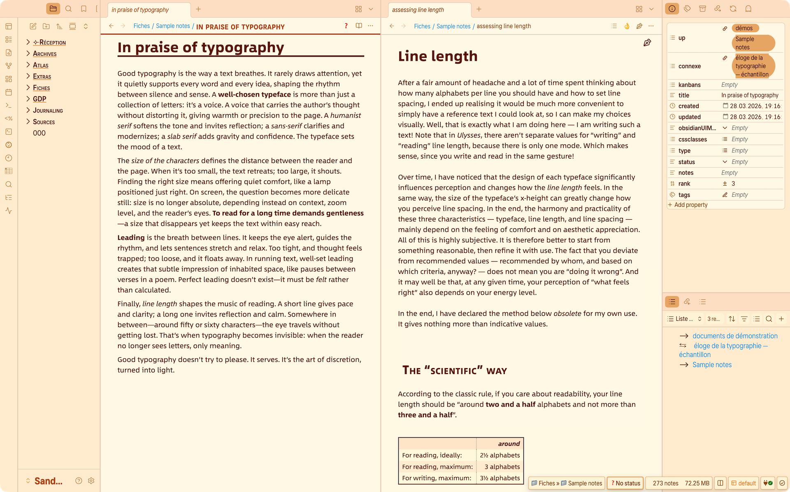

# Olivier’s Theme 3.0

An advanced interface theme for [Obsidian](https://obsidian.md/) focused on **legibility**, typography, and a calm, paper‑like writing environment.  
It combines a rich set of color palettes with a carefully structured set of options via the Style Settings plugin.

> If you enjoy long‑form thinking, journaling, research, or simply beautiful notes in a calm environment, this theme is designed to stay out of your way while keeping your notes extremely readable.

Full documentation for version 3.0 is available in the [User Guide](https://olivierps.github.io/Olivier-s-Theme/).

---

## Features

- **Typographic comfort for both reading and writing**  
  Headings, body text, and vertical rhythm are tuned for long notes and reference material, with options that are deliberately designed for both reading comfort and writing comfort, not just for screenshots.

- **Rich but safe color customisation**  
  Version 3 uses a perceptual color system with improved and new palettes, including one that spans the full 360° hue range. You can adjust overall intensity to match your preferred atmosphere, while the theme quietly avoids the most chaotic combinations so things stay readable and coherent.

- **Cascading settings, not endless tweaking**  
  Many options work in layers: Light mode settings cascade into Dark mode unless you override them, and Reading mode builds on Writing mode for both colors and typography. Small adjustments can therefore transform the look of the theme without forcing you through dozens of switches.

- **One theme, many “moods”**  
  Out of the box, the theme can approximate several familiar environments: calmer setups reminiscent of Ideaverse — or LYT‑style layouts, more opinionated looks inspired by Solarized, classic terminals, typewriter‑like views, or nostalgic word‑processor vibes — all within a single, coherent theme.

- **Carefully designed elements and note‑level refinements**  
  Lists, tables, quotes, and images are styled with several sensible defaults, including multiple table styles and image sizing options. A set of cssclasses lets you fine‑tune individual notes (Bases headers, table width, image size, reading‑mode text size) without touching the underlying CSS.

- **Extensive integration with community plugins**  
  The theme includes dedicated styling for many popular plugins such as Calendar, Dataview, Kanban, Metadata Menu, TaskNotes, Dynamic Outline, Floating TOC, Related Notes, Note Status, Vertical Tabs, and others.

---

## Palette logic

- Start with the main palette in **Light mode**: this single choice defines the overall mood of the theme and automatically selects a coordinated Dark counterpart.  
- If you like, you can then **override the Dark palette** with a different mood (for instance, a warm Light palette and a cooler Dark palette) without breaking the underlying color balance.  
- In both Light and Dark, the **reading background** and the **editing background** are coordinated by default, but each can be adjusted independently when you need a clearer visual separation between “reading” and “writing”.

For a detailed description of each palette and how the Color intensity slider behaves, see the [palettes documentation](https://olivierps.github.io/Olivier-s-Theme/palettes-descriptions/).

---

## What’s new in 3.0

- A more modern color system with improved and new palettes, including a full‑hue palette and an intensity slider for fine‑tuning the overall atmosphere.  
- Stronger typography and vertical rhythm, with clearer separation between Reading and Writing modes and more control over headings, lists, and separators.  
- A more structured settings layout with dedicated sections for Interface, Typography, Kanban, Light mode colors, Dark mode colors, Reading mode, and Writing mode.  
- Expanded cssclasses support and new note‑level niceties to adjust Bases headers, table width, image sizing, and reading‑mode text size on a per‑note basis.  
- Many small visual refinements and fixes across the theme and its plugin integrations.

For a broader overview, see the **What’s new in version 3** section in the [User Guide](https://olivierps.github.io/Olivier-s-Theme/).

---

## Installation

- From Obsidian:  
  - Open **Settings → Appearance → Themes → Manage**.  
  - Search for “Olivier’s Theme” and click **Install**, then **Use**.  

- From GitHub:  
  - Download the theme file from the releases on GitHub and place it into your vault’s `.obsidian/themes` folder.  
  - Select it under **Settings → Appearance → Themes**.

---

## Recommended plugins

The theme works with defaults out of the box, but it is designed to shine with the **Style Settings** plugin, which is required to access the customization options.  

The theme also includes dedicated styling for many community plugins, such as (non‑exhaustive): Calendar, Dataview, Kanban, Metadata Menu, TaskNotes, Dynamic Outline, Floating TOC, Related Notes, Note Status, Vertical Tabs, QuickAdd, and others.

---

## Customization (Style Settings)

Once the theme and Style Settings are enabled, you will find a structured list of options:

- **GENERAL settings** – Interface scaling, sidebar text size and spacing, headings, status bar padding, canvas options, etc.  
- **LIGHT / DARK MODE colors** – Choose light and dark palettes, adjust color intensity, and fine‑tune accents and backgrounds for Reading vs. Writing.  
- **READING / WRITING modes** – Control line length, font families, line height, and a range of niceties so that reading and writing can share a coherent feel or deliberately diverge.  
- **KANBAN** – Visual settings for Kanban boards, including typeface, text size, and lane width.  
- **Niceties & cssclasses** – Additional note‑level refinements using cssclasses, for Bases, tables, images, and text size in Reading mode.

For more details, refer to the [User Guide](https://olivierps.github.io/Olivier-s-Theme/).

---

## Feedback

Issues and suggestions are very welcome. If you use Olivier’s Theme in a particular workflow or with specific plugins and notice something that could be improved, feel free to open an issue or share your experience on the Obsidian forum.
