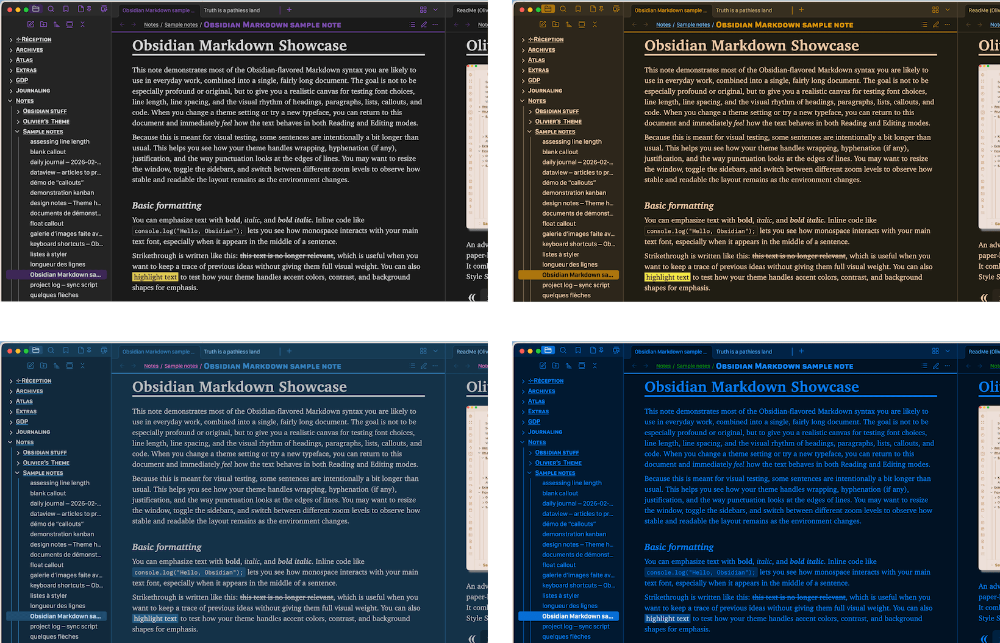
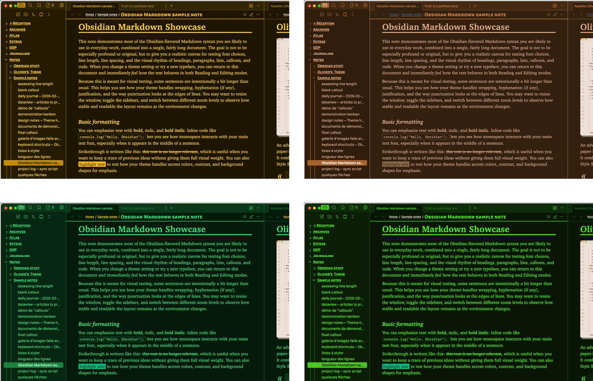
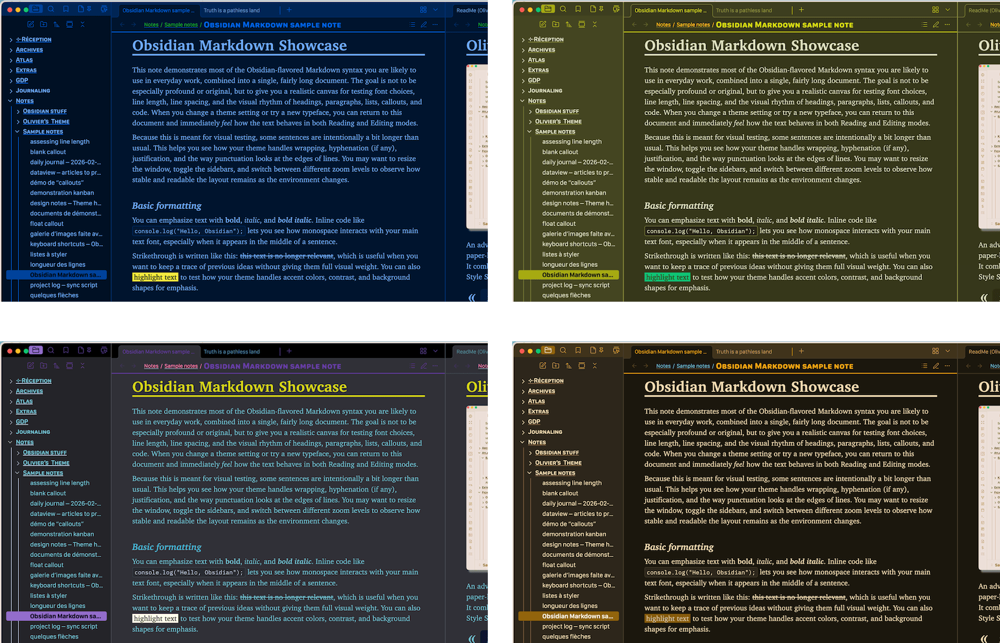
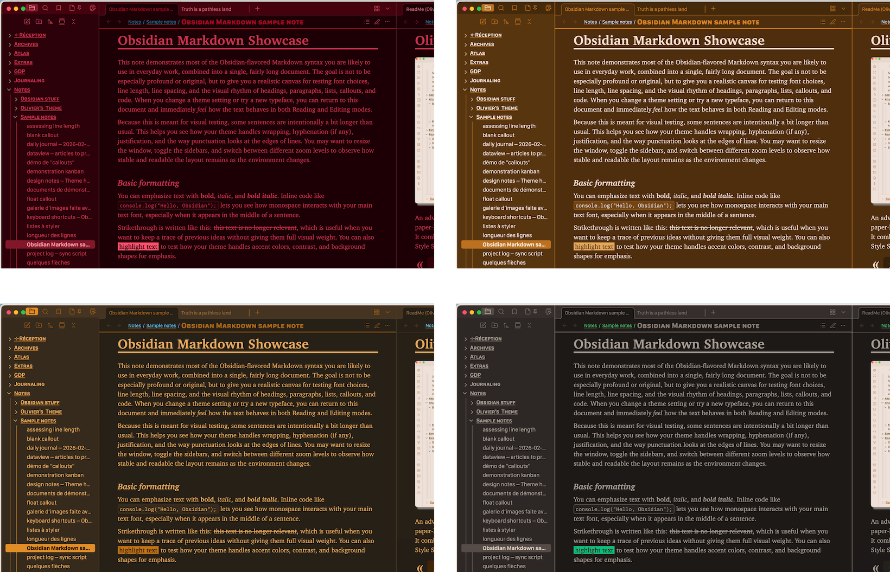
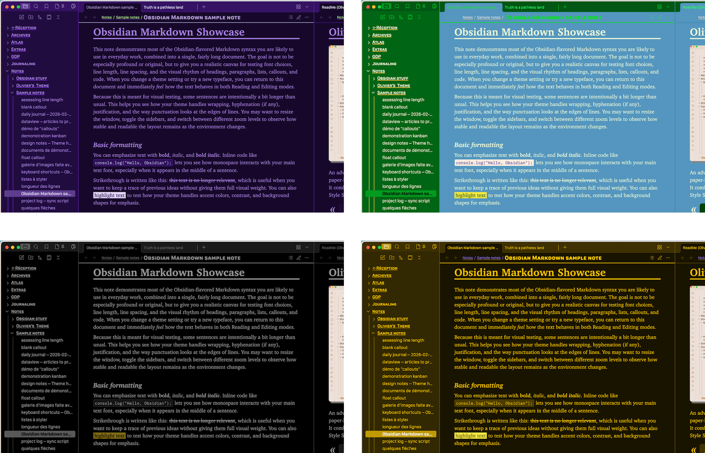
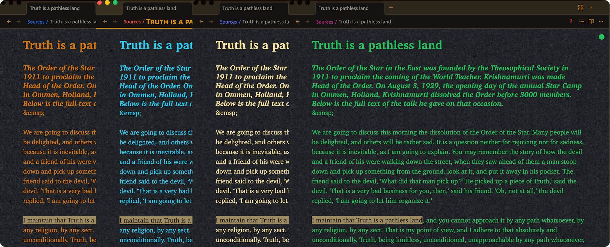
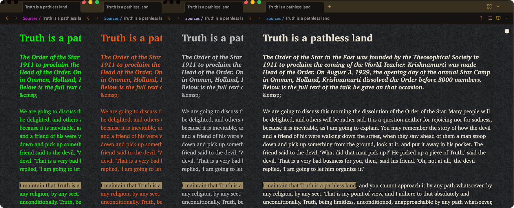
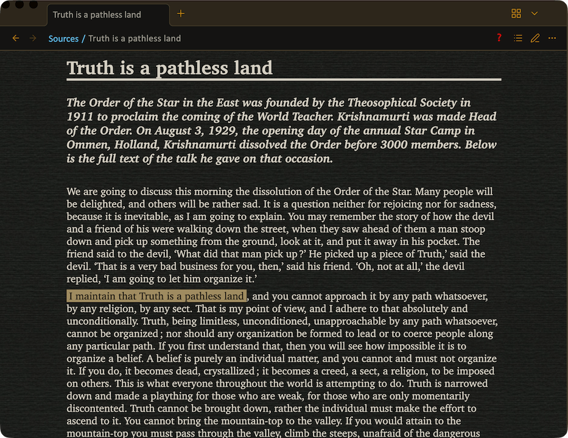
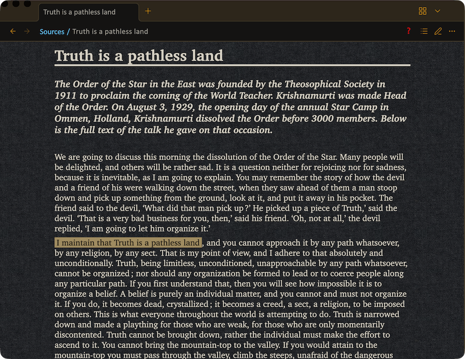
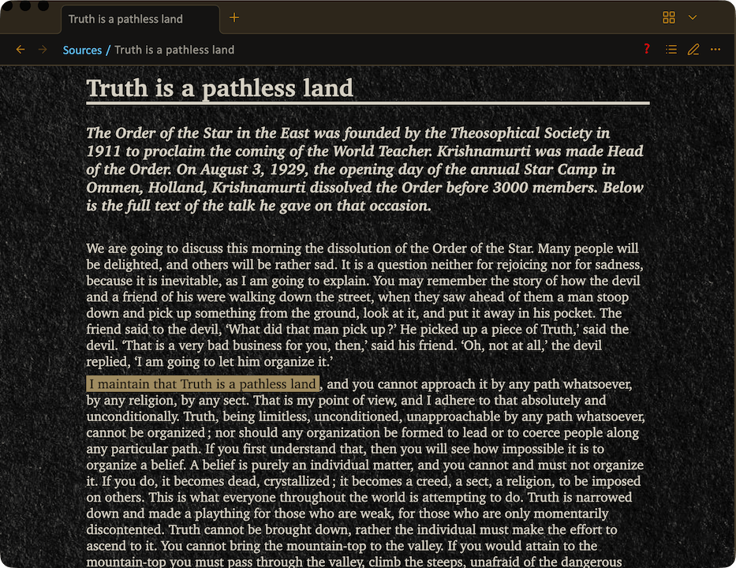

# Color samples – Dark

A few visual examples of Dark mode color combinations.  
Use this page as a compact gallery linked from the **Dark mode colors** guide.

## General palette 

Some examples of Dark palettes, including the automatic **Default < light mode** and a few explicit Dark choices.

---

## Text color in Reading mode 

Samples of “ink on dark” combinations: soft beiges, cyans, terminal-like greens, etc., all shown on the same paper background.

---

## Notes background in Reading mode 

The 3  **black papers** available as backgrounds for your notes in Reading mode :

---

## Highlighting color 

Examples of highlight colors that stay readable over dark backgrounds.

<!-- zzz 

-->
