# Color samples – Light

A few visual examples of Light mode color combinations.  
Use this page as a gallery linked from the **Light mode colors** guide.

## General palette 

Some of the colors you can choose for the general mood of your vault in **Light Mode**. There are quite a few more !

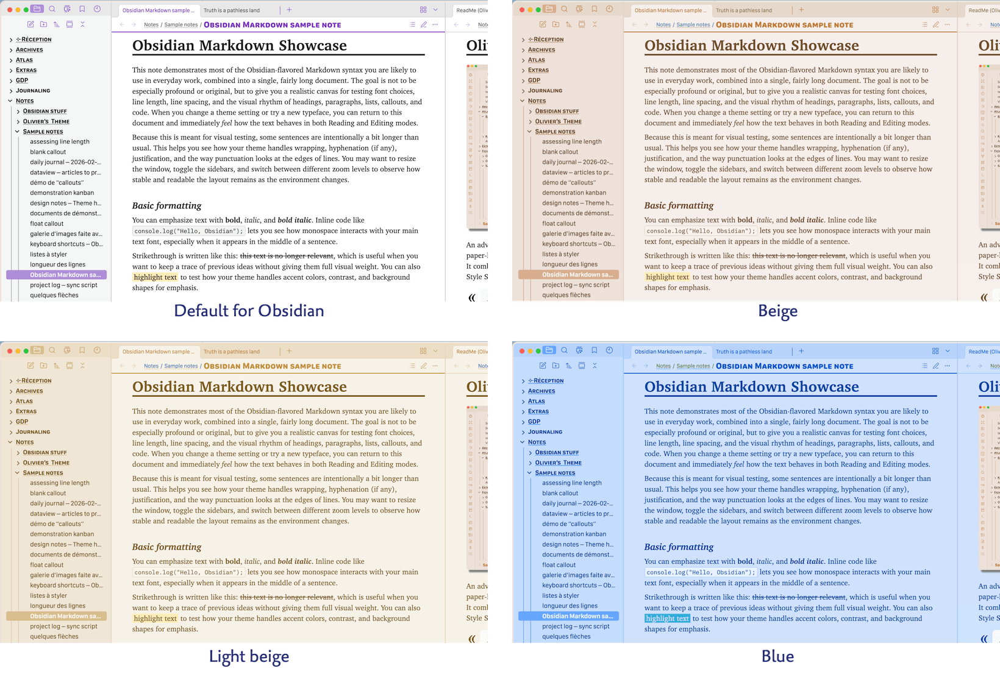

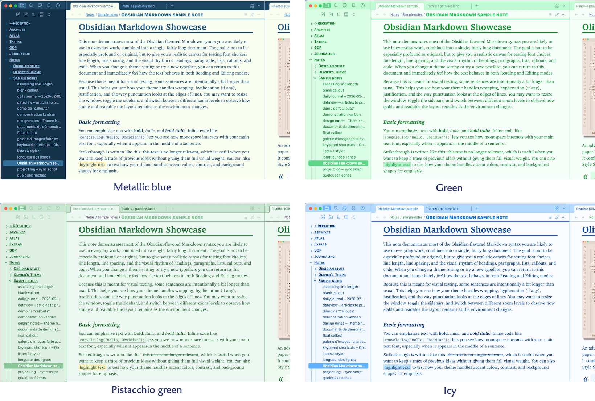
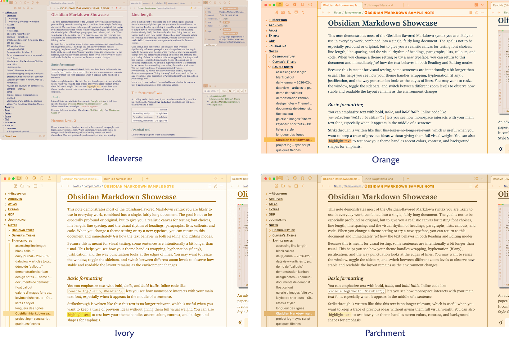

---

## Accent color 

The 3 accent color shown for the **Parchment** general palette. To better show the effects, the options “Color H1 to H5 headings” and “Text selection takes accent color” has both been activated.

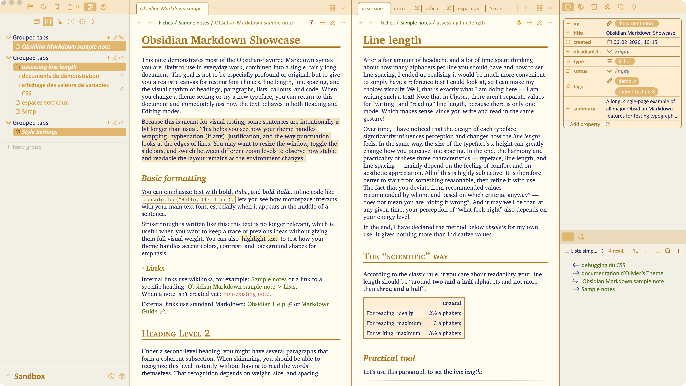

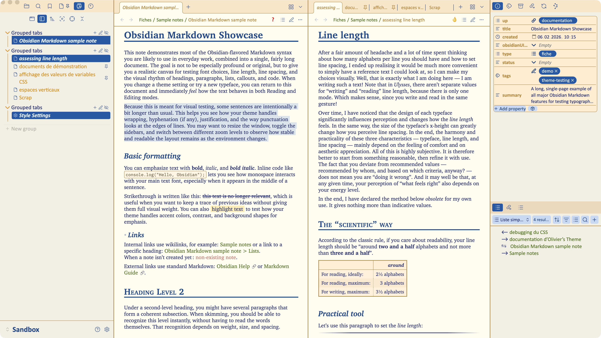

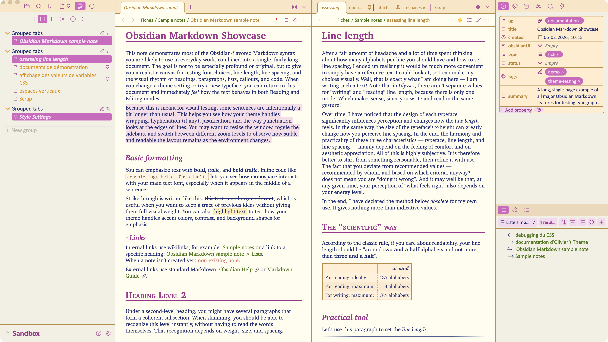

----------------------------------------------

## Text color in Reading mode 

A few of the text inks you can choose with this parameter. They are shown on a paper background to give an idea of the “pen on paper” feeling.

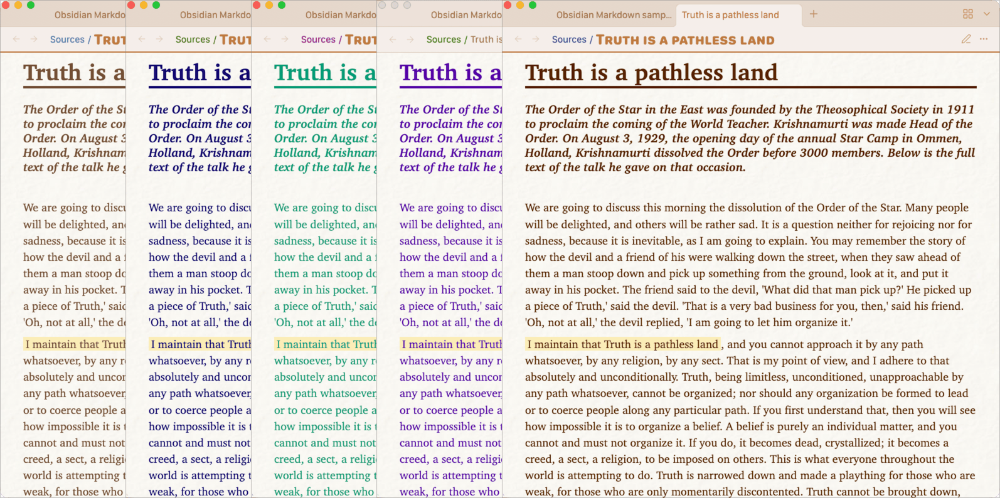

---

## Notes background in Reading mode 

**Parchment** general palette, *different notes background* :

* **None** — means a plain background as defined by the palette.

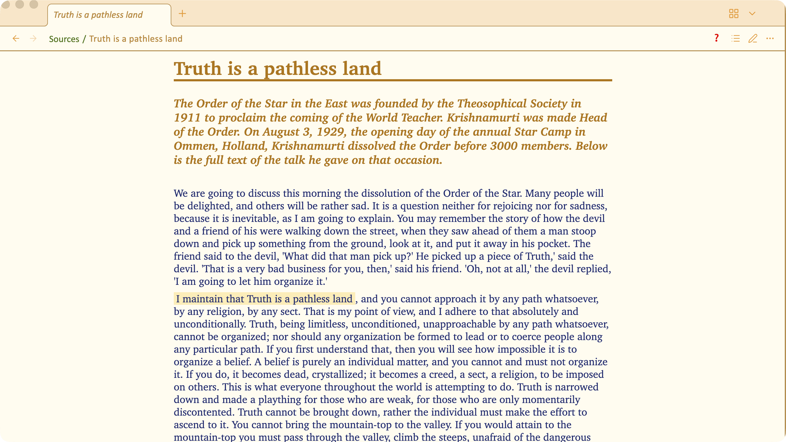

* **Paper 1** :

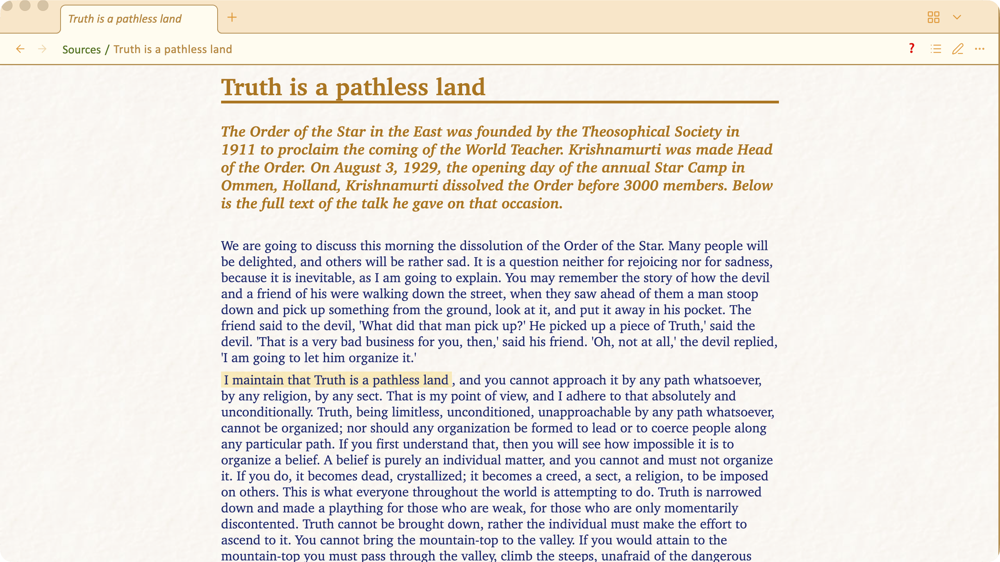

* **Paper 2** :

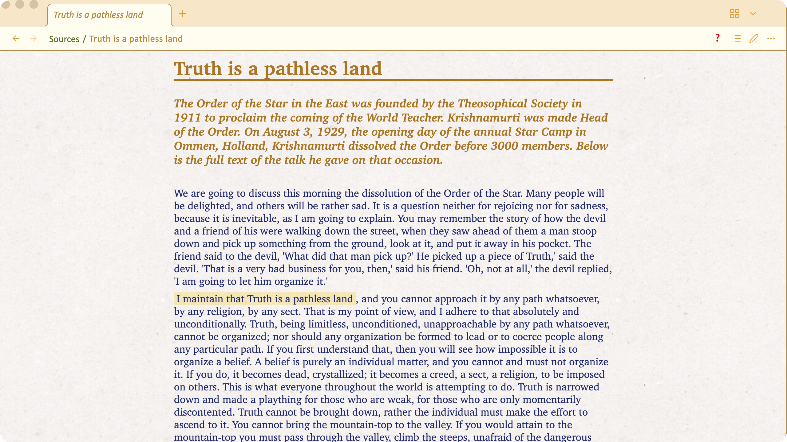

* **Paper 6** :

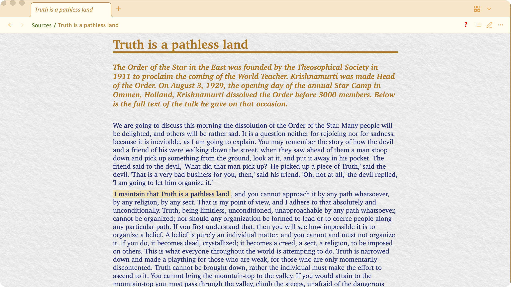

* **Parchment** :

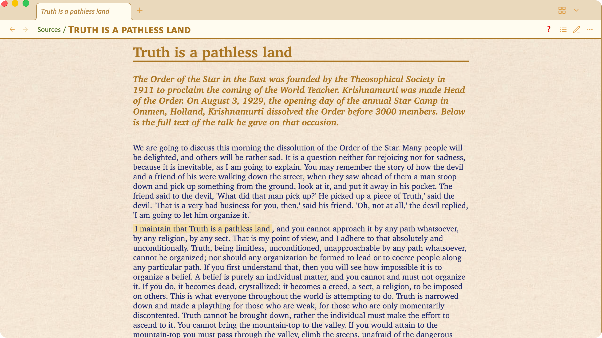

---

## Notes background in Writing / Editing mode 

Examples of editing “moods” than can be obtained by changing the background color of the note at the same time as the color of the text is changed and possibly the typeface.

Beige palette, default background and text color, Charter typeface :

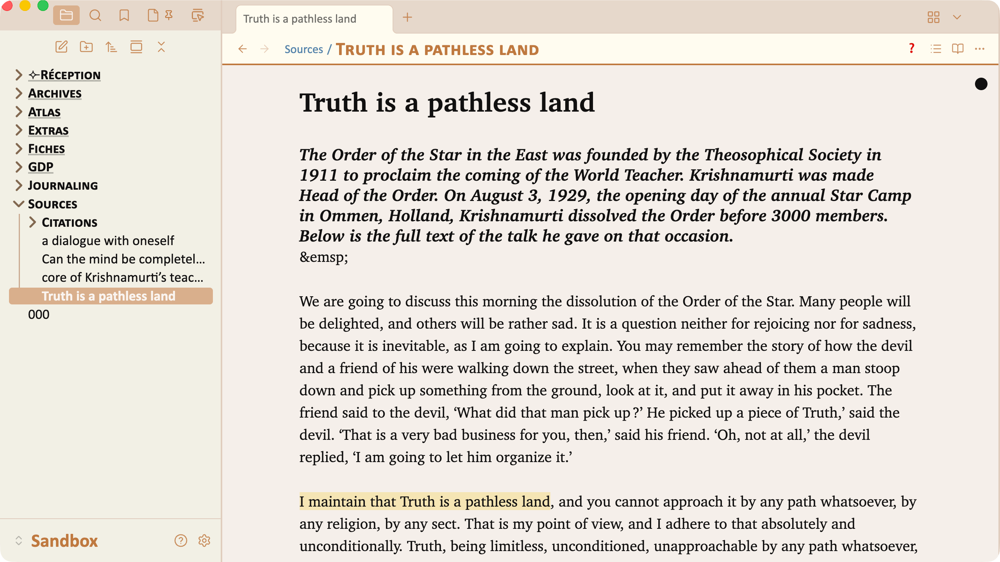

Beige palette, **snow white** background, **dark blue** text, **American Typewriter** typeface :

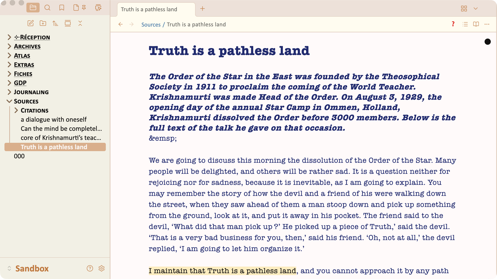

Beige palette, **black** background, **terminal green** text, **IBM Plex mono** typeface :

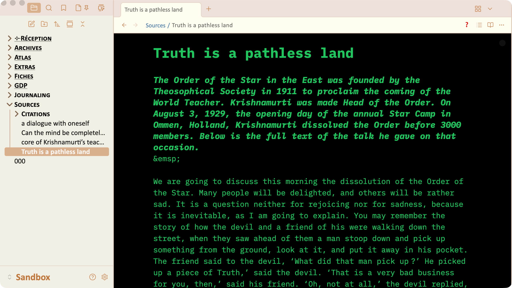 

Beige palette, **light green** background, **emerald green** text, **Palatino Sans** typeface :

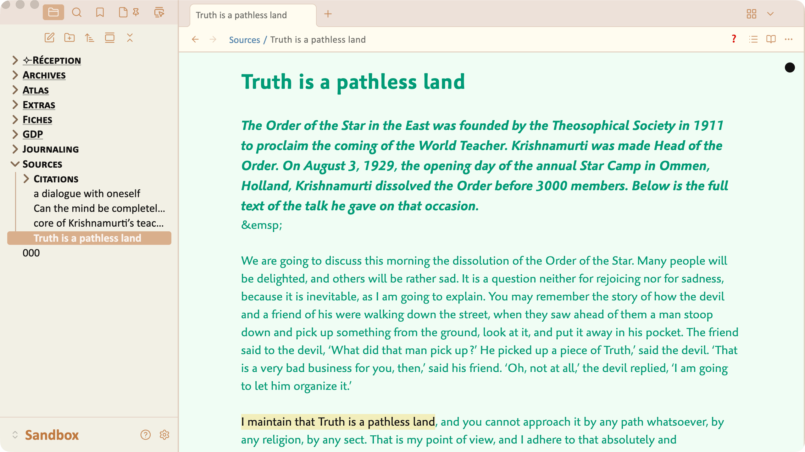 

---

## Highlighting color 

Just some samples of different highlighting colors. Note how the text remain legible in all situations.

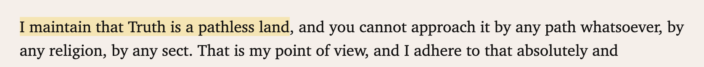

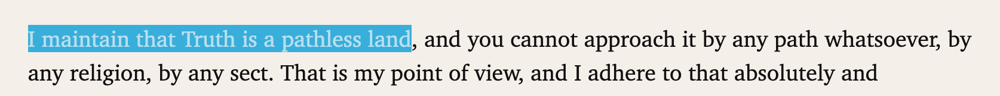

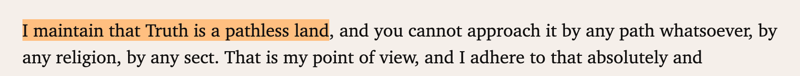

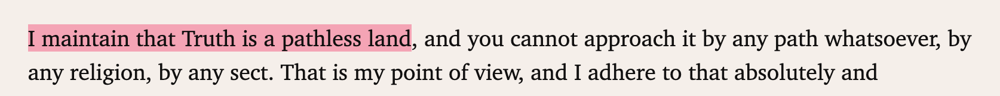

---

## Color of the pills inside the Properties panel 

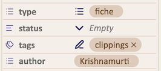

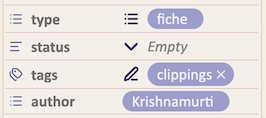

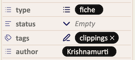

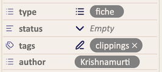

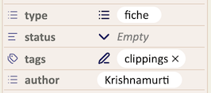