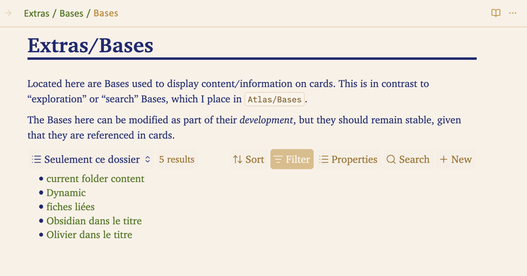
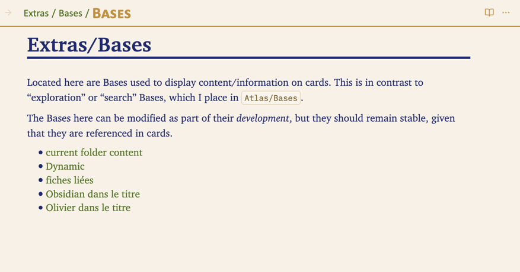
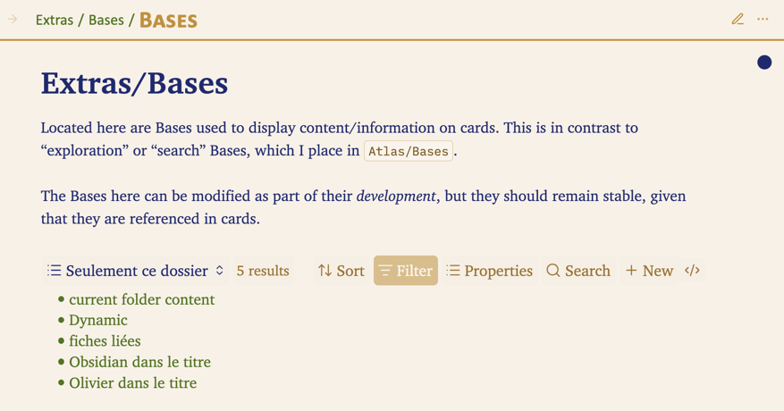
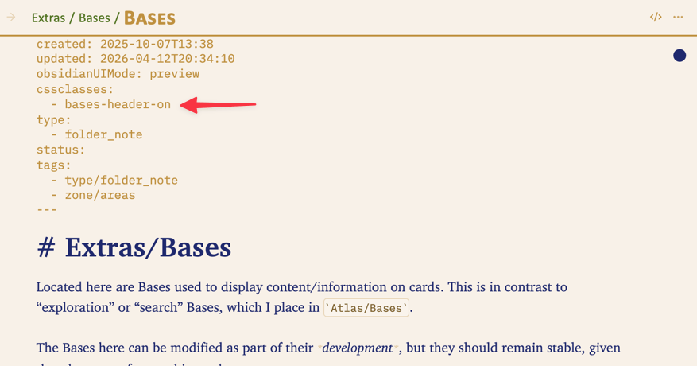

# Displaying bases

Sometimes the header of a Base is more distracting than helpful when you are simply reading or consulting notes.  

Here is a concrete example: this is a *folder note*[^1].

[^1]:  A “folder note” is a note managed by the [Folder Note](obsidian://show-plugin?id=folder-notes) plugin. It documents the folder it belongs to and usually shares the same name as that folder.

Below, you see it in Reading mode, with the header of a Base visible — this Base lists the contents of the folder.

Here is the same note with the same Base, but this time the Base header is hidden:

You can see how the note becomes simpler and more readable, more **typographic**.

There are two ways to hide this header:

1. You can enable the **Bases: hide header in Preview** setting in the “READING mode” section of the theme settings.  
	When this setting is ON, the header of all Bases is hidden in Reading mode, in all notes.

1. You can hide the header **note by note** by adding the **bases-clean** CSS class to the `cssclasses` property, on the notes where you want to hide the header, if you have not enabled the global option mentioned above.

	If you have globally hidden Base headers, you can still manage the options of any Base by switching the note to **Live Preview**:

**One last point.**  
When the **Bases: hide header in Preview** option is enabled and you *still* want to display the header of one or more Bases in a given note, you can always add the `bases-header-on` class to the `cssclasses` property:

For more information about how Bases work in Obsidian itself, you can refer to the official Obsidian documentation on Bases:   → [Introduction to Bases - Obsidian Help](https://obsidian.md/help/bases)