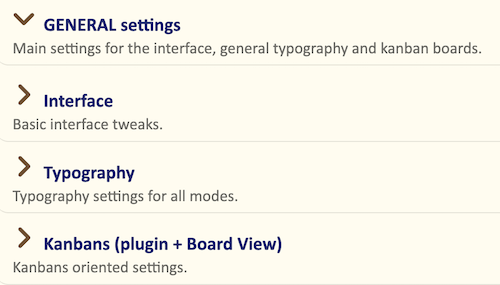
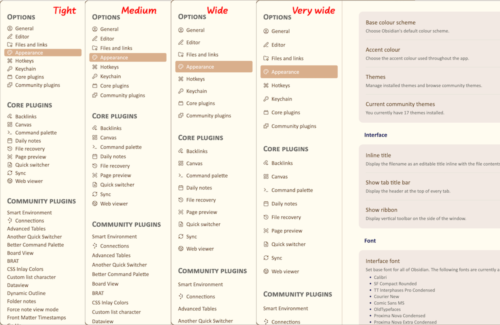
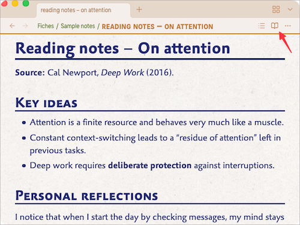
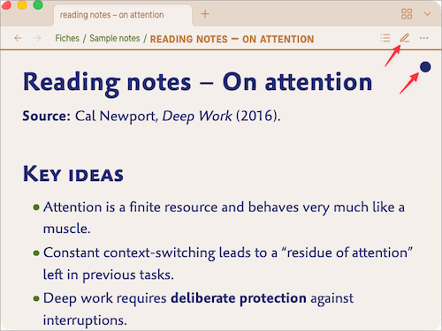
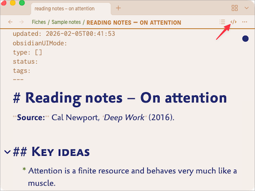
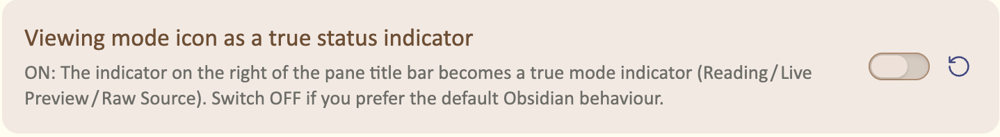

# General settings

The **GENERAL settings** group controls global aspects of the theme not specifically geared towards Reading or Writing. These settings are grouped in 3 sections :

* **Interface** — base size of UI text, the spacing of file listings in side panels, etc.
* **Typography** — scaling of the headings, vertical rythm, etc.
* **Kanbans** — typeface, text size and width of the lanes

## Interface

### Base size for the interface texts (px)

This value sets the **base font size for most interface elements**:

- file and folder names in the sidebars  
- items in the status bar  
- text in modal dialogs (settings, command palette, etc.)  
- tab titles at the top of each panel  

The default is **16 px**, the same as *Obsidian*’s native theme. On a typical desktop display, it may feel too small — that’s why you can adjust this value.

The theme uses this value as a reference for many UI elements, so most of the interface will scale consistently with this single control.

> Tip: to see quickly which parts of the UI are affected, you can temporarily choose a very distinctive interface font in  
> `Settings → Appearance → Fonts → Interface font` (for example, Courier).

<!-- screenshot: a settings modal with interface font size slightly increased -->

### Spacing for items in sidepanels and settings panel

This option controls the **vertical spacing of file rows** in the side panels (file explorer, search results in sidebars, etc.), as well as some lists in the settings panel.

You can choose between four presets:

- **Tight** – rows are compact, useful if you want to see as many files as possible at once.  
- **Medium** (default) – a balanced spacing that works well on most screens.  
- **Wide** – more breathing room between items.  
- **Very wide** – very generous spacing, comfortable on large monitors or maybe for tapping items on a touchscreen.

### Viewing mode icon as a true status indicator

On the right of the title bar, there’s an icon in relation with the current mode of the current pane. By default, *Obsidian* shows an open book while you’re editing and a pencil while you’re reading a note. Many people, me included, find this disturbing, even confusing. *Olivier’s Theme* brings a better solution :

* an **open book** is displayed while you’re reading: 

* a **pencil** is displayed while you’re editin in Live Mode ; furthermore, you have a dot in the upper right corner of your pannel, indicating the note is currently in *editing mode* : 

* a **symbol** is displayed while you’re editing in Raw Mode — the “editing dot” is still there, of course : 

If you don’t like this feature, you can switch it OFF and revert to the “original” *Obsidian* behaviour :

### Highlight current tab

This option adds a stronger visual emphasis to the **currently active tab** in each panel.

It is especially helpful when:

- you work with several tabs in the same pane, or  
- you use stacked tabs and want to see clearly where your keyboard focus is.

When enabled, the active tab uses the accent color and stands out more clearly from background tabs, in addition to the active‑pane header styling.

<!-- screenshot: multiple tabs with one clearly highlighted -->

### Hide Title Bar breadcrumb

Obsidian can display a breadcrumb in the title bar at the top of the window  
(vault name, current note, and sometimes the active plugin view).

If you find this visually noisy or redundant with the tab titles,  
turning **Suppress the Title Bar breadcrumb** ON removes this breadcrumb while keeping the rest of the title bar intact.

This frees a bit of vertical space and gives a cleaner top edge to the window.

### Status Bar padding

This setting adjusts the **padding between the status bar and the screen right and bottom borders**.

- With a padding of 0 (zero), the status bar is directly against screen border, liberating space inside the window.  
- Any higher values gives space between the status bar and the borders of the screen. It may be aesthetically more pleasant, but it takes space inside the window.

Please note that you can use the **Hider** plugin and assign a keybord shortcut to its “Toggle status bar” command. 

<!-- screenshot: status bar with minimal vs generous padding -->

### Width of the properties labels

This option sets the **width of the label column** in the Properties panel.

- In the **Properties section at the top of notes**, increasing this width prevents long property names from being cropped or wrapped in an awkward way. The labels stay fully readable, at the cost of using a bit more horizontal space in the note pane.
- In the **Properties sidebar view**, decreasing the width makes the labels more compact and frees space for the note content itself. This can be useful if you keep the Properties panel docked in a narrow sidebar and want to maximise the visible text.

If your property names are short, a smaller width keeps everything tight and efficient.  
If you rely on longer, descriptive keys, a slightly larger width will usually make the layout clearer and more comfortable to read.

<!-- screenshot: properties panel with narrow vs wide labels, both at the top of a note and in the sidebar -->

### Hide embed titles

When you *embed* — i.e. *transclude* — a note inside the current note, *Obsidian* shows the filename of the transcluded note at the top of its content. This is very often disturbing, hence the possibility to suppress this filename with this setting. It is ON by default, meaning that only the content of the transcluded note appears in your current note. Switch OFF this setting if you **do** want to see the filenames of your transcluded files.

### Hide canvas dot pattern

In Obsidian’s **Canvas** view, the default background shows a subtle grid of dots.  

Turning **Hide canvas dot pattern** ON removes this dot pattern and replaces it with a plain background.  
This can make complex canvases feel less busy and keeps the focus on cards, notes and connectors rather than on the grid.

If you rely on the dots to align items precisely, leave this option OFF.  
If you prefer a quieter visual field, enabling it often feels more “paper‑like”.

<!-- screenshot: canvas view with dot pattern vs plain background -->

## Typography

### Headings and subheadings scaling

Headings (H1–H6) already have visual cues in Olivier’s Theme: spacing, rules, weight and style.  
The **Scaling of the headings and subheadings** option lets you decide how much their **size** should increase from H6 up to H1.

There are several presets, including:

- **None** – all headings use the same size as the body text; hierarchy is indicated only by styling and spacing.  
- **Minor second / Major second / Minor third / …** – musical‑interval based scales that progressively enlarge headings.  
- The “**Olivier’s** ” default gives a clear but not exaggerated hierarchy.

On small laptops or tablets, you may prefer a modest scale (for example *Minor second*), while on large external monitors a stronger scale can make documents easier to scan.

A simple tuning strategy:

1. Open a long note with several levels of headings.  
2. Change the **Scaling of the headings and subheadings** preset.  
3. Stop when the hierarchy feels obvious at a glance, but headings do not dominate the page.

<!-- screenshot: the same note shown with “None” vs default scaling -->

### Typographical vertical rythm

Controls the overall vertical spacing between headings, paragraphs and block elements. A tighter rhythm puts more information on screen; a more generous rhythm creates a calmer, airier page. The “Tight” setting suits small screens, “Generous” gives a book‑like feel on larger displays, and “Bear” reproduces the regular rhythm many people enjoy in the Bear Markdown editor.

### Lists: Text size stepping down

When this option is OFF, all list levels use the same text size as the body text. When it is ON, list items from level 1 to level 4 become progressively, subtly smaller, so deep nesting stays visually lighter without losing readability.

### Lists: vertical spacing, line spacing

Controls the vertical spacing between list items and the line height inside multi‑line items. Normal keeps lists close to the surrounding text; Tight packs more items on screen. If you work with long checklists or nested lists, Tight can reduce scrolling at the cost of a denser look.

### Lists: Indenting

Sets how far list bullets, numbers and nested levels are indented horizontally. Normal matches a classic document layout; Wide and Generous give more room to nested content. If you use deeply nested lists, a wider indent helps keep the structure legible, especially on larger screens.

### Suppress line wrapping within code blocks

When this option is **ON**, code blocks in Reading mode will **not wrap long lines**:  
they will stay on a single horizontal line and can be scrolled horizontally if needed.

This behaviour is often preferable for:

- code samples  
- command‑line snippets  
- configuration files

When the option is **OFF**, code blocks wrap like normal text, which can be more comfortable on narrow screens but sometimes makes code harder to read.

<!-- screenshot: same code block with wrapping on vs off -->

## Kanbans (plugin + Board View)

### Kanban – General font

The **General font** setting lets you choose the typeface used for column titles and card text in Kanban boards.

You can keep it aligned with your main text font for a unified look,  
or pick a more playful font (for example a handwritten style) to give your boards a distinct personality.

<!-- screenshot: Kanban board showing two different fonts -->

### Kanban – Size of the cards text (px)

This setting controls the **text size inside Kanban cards**, in pixels.  

If your boards feel cramped or hard to read, increase this value slightly.  
If you use very dense boards with many cards, decreasing it can help fit more information on screen without scrolling.

### Kanban – width of the lanes (em)

The Kanban plugin has its own setting for lane width; this option applies specifically to the Board View plugin. It defines the width of Kanban lanes in em units. Narrower lanes display more columns simultaneously but may increase card height; wider lanes make long card titles and descriptions easier to read, at the cost of showing fewer columns side by side.
