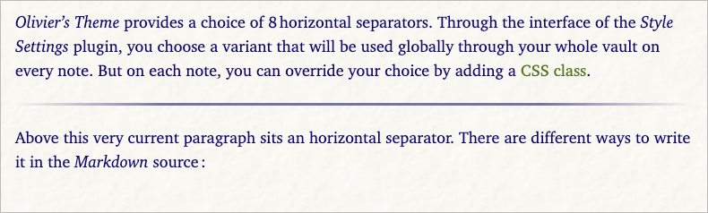
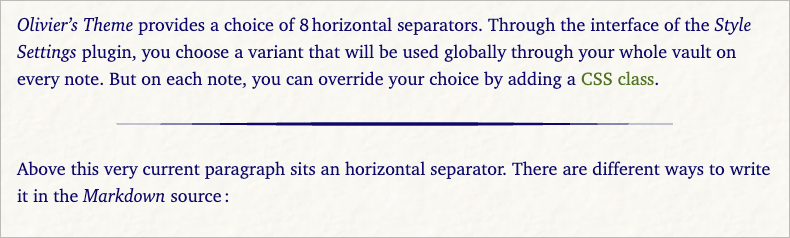
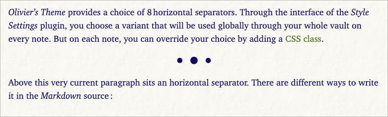
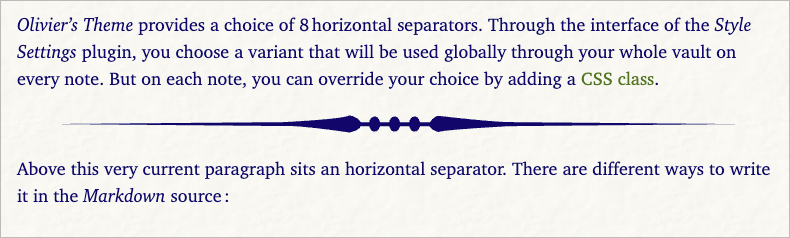
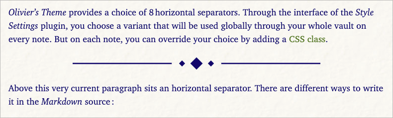
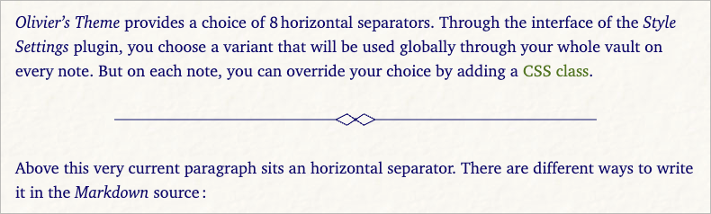
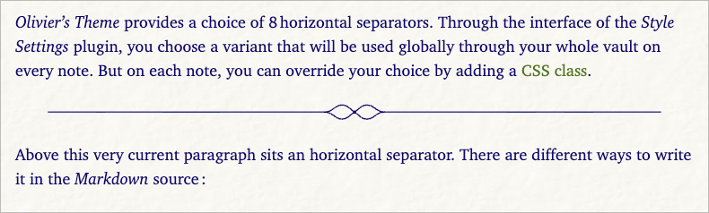
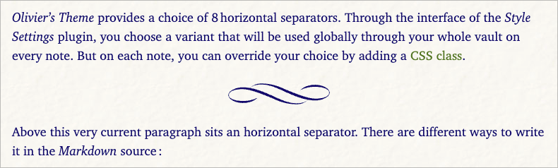

# Horizontal rules and decorative separators

Horizontal rules are a subtle but powerful way to mark transitions inside long notes: a change of scene in journal entries, a new section in longer notes, or a shift of topic in research documents. *Olivier’s Theme* offers a full set of separator styles, from a simple rule to more decorative fleuron‑like ornaments, all aligned with the theme’s typographic vertical rhythm.

You can choose which style best matches the tone of your notes, and you can fine‑tune spacing and optical alignment so separators feel naturally integrated in the page, rather than pasted on top.

----

### Base behavior and spacing

#### Color

The separator follows your normal text color, so rules and ornaments feel like they belong to the same ink as your paragraphs.

#### Space before / after separators

The separators are meant to add vertical clarity between text sections. Hence, the space above and below them follow your choice for the **vertical rythm**, that you set under “**GENERAL settings > Typography > Typographical vertical rythm**” — Tight / Normal / Generous / Bear.

----

### Separator variants

Olivier’s Theme defines several separator variants that you choose globally, for the whole vault, under **GENERAL settings > Typography > Text separators**. You can also choose on a per-note basis through the `cssclasses` mechanism, as described ⭢ [here](css-classes.md).

#### Variant 01 – simple line (footnote‑style)

This variant is a plain, slightly thicker horizontal rule, without any SVG ornament. It is the most neutral option and works well in technical notes, quick scratchpads, or anywhere you want a clear break with minimal decoration.

- The line spans the whole text column.
- The thickness is slightly stronger than a hairline, similar to the rule often used above footnotes in books.

Use this when you simply want a clean, confident rule, especially if your notes already contain many other visual elements (tables, callouts, screenshots).

#### Variant 02 – tapered line

The tapered line is a more refined horizontal rule: the center is stronger and the ends are gently thinned out. It suggests a soft pause without shouting for attention.

Use this when you want something more elegant than a plain rule, but still relatively quiet and modern.

#### Variant 03 – minimal triple dots

This variant draws three dots of different sizes, centered in the text column. It is highly minimal: more of a typographic gesture than a true “line”.

Use this for gentle scene breaks, especially in journal‑like notes or narrative writing.

#### Variant 04 – bubbles

The bubbles separator uses a playful curve adorned with small circular forms. It brings a bit more personality to the page while remaining thin enough to avoid feeling heavy.

Use this when you want a slightly whimsical separator, for example in personal notes, creative projects, or teaching materials.

#### Variant 05 – diamonds

This variant draws two horizontal strokes with three diamonds in the center. It has a more formal, almost bookish tone.

Use this when you want a classic, book‑inspired separator that still feels clean and modern.

#### Variant 06 – geometric Art Deco

This separator uses symmetrical arrows, lines and a central circle, with thin strokes inspired by Art Deco geometry. It is more assertive than the previous styles, but still fairly light.

Use this when you want a decorative separator that gives notes a slightly “architectural” or editorial feel.

#### Variant 07 – light fleuron

The light fleuron combines thin horizontal lines with a small curved ornament in the center. It is deliberately understated, more literary than geometric.

Use this when you want a traditional booklike separator, but in a very light, modern drawing.

#### Variant 08 – decorative fleuron

This is the most elaborate separator: a mirrored, curved fleuron motif reminiscent of classic book ornaments. Despite its richer drawing, its overall size is kept compact.

Use this sparingly, for example to mark chapter‑like breaks in long documents or to highlight especially meaningful transitions.