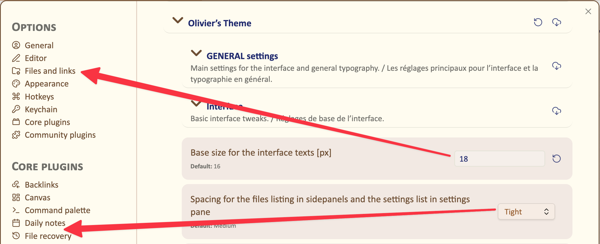
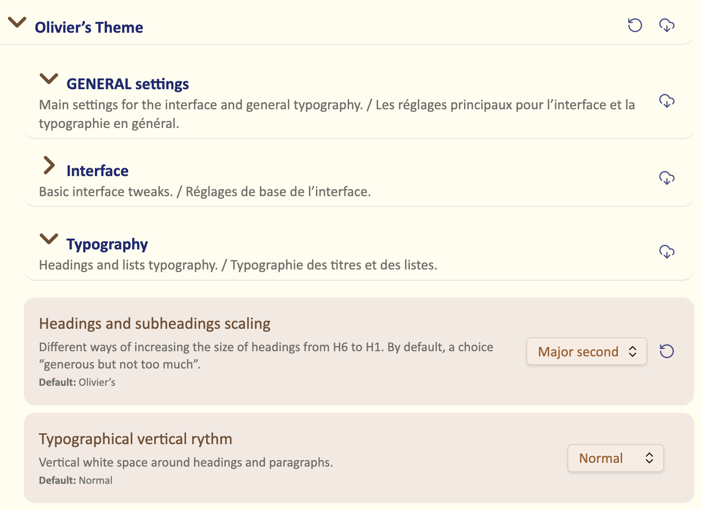
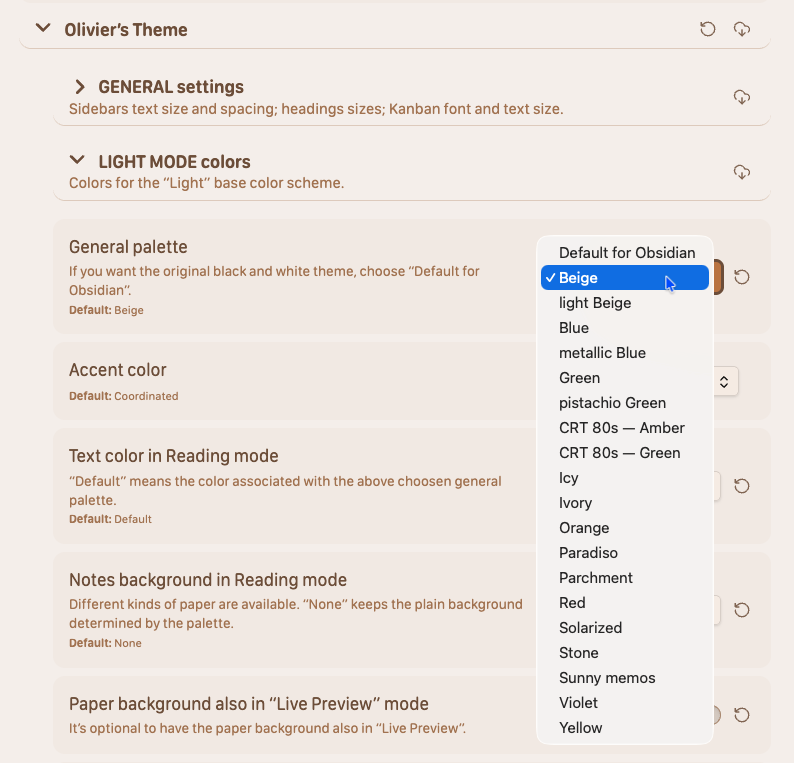
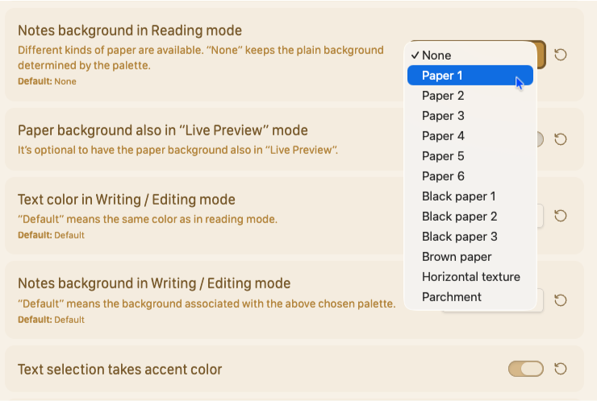
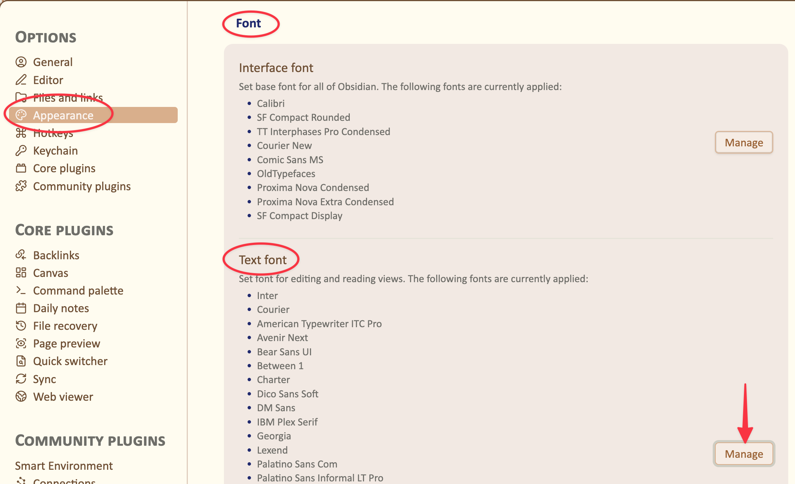
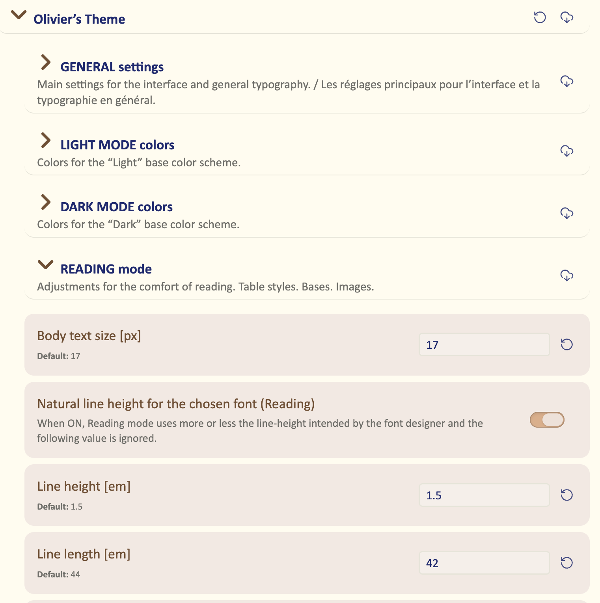

# Olivier’s Theme 2.0 ⬩ User Guide

Olivier’s Theme is a refined interface theme for Obsidian that focuses on legibility, calm color palettes, and a clear separation between **reading** and **writing**. It is designed for people who spend a lot of time with long notes – journaling, research, psychotherapy notes, technical writing – and who want the interface to support, not distract, their thinking.

This User Guide explains how to get the most out of the theme, from the global interface settings to fine‑grained typography and per‑note cssclasses. It assumes you already know the basics of Obsidian and want to tune your workspace rather than learn Obsidian itself.

______________________________________________________________________

## Before you start

To follow this guide and access all options, you will need:

- [Obsidian](https://obsidian.md/) 1.5 or later.
- [Olivier’s Theme](https://github.com/OlivierPS/Olivier-s-Theme) installed and active.
- The **[Style Settings](obsidian://show-plugin?id=obsidian-style-settings)** plugin enabled, to access the theme’s configuration panels.

The settings described here live under **Settings → Appearance → Style Settings → Olivier’s Theme**.

______________________________________________________________________

## How this guide is organised

You do not have to read everything in order. The chapters are grouped by mental tasks:

- Start with **[General](general.md) settings** to set global choices about the **interface** and the **typography**.
- Then pick your **[color palette](colors-light-dark.md)** for **Light** mode. The **Dark** mode palette is automatically derived from your choice, but you do have the possibility to choose a different one if you so wish.
- Tune **[Reading mode](reading-mode.md)** for a comfortable, book‑like experience.
- Tune **[Writing mode](writing-mode.md)** to your prefered writing environment.
- Finally, explore **[cssclasses and niceties](niceties-and-cssclasses.md)** for per‑note refinements and special layouts.

If you are in a hurry, you can simply follow the “Quick path” below.

______________________________________________________________________

## Quick path ⬩ 5‑minute setup

The theme’s defaults are very close to those of the standard Obsidian interface. However, you may prefer different settings depending on the device you are using — whether a smartphone, tablet, laptop or desktop monitor.

**N. B.:** only the most relevant settings are described here; for more details, see the detailed pages.

### 1. Set interface choices

Open **GENERAL settings > Interface** and adjust:

- “Base size for the interface texts (px)”, so sidebar text and UI labels are comfortable on your screen.
- “Spacing for the files listing”, so the file explorer feels right for your view and current conditions.

### 2. Set the main typographical choices

Under **GENERAL settings > Typography** :

 you have two options that are especially important for working comfortably on your current screen:

* The ***scaling*** of the H1 to H6 headings : choose what feels right for you, neither too small nor too overwhelming.
* The ***vertical rhythm*** of your text : tighter on a small screen, more generous on a large desktop monitor. The “Bear” choice mimics what you have in the *Bear* text editor, that many people find particularly pleasing, hence the “Bear style” option also available under *Headings scaling*.

### 3. Choose your color palettes

In **LIGHT MODE colors**, pick a palette that fits your taste; a coordinated Dark palette is selected automatically.

Feel free to experiment with the different options.

##### Choose a paper background

I do particularly recommend that you try a  *paper background* under the **Notes background in Reading mode** option. With this option, you can read your notes written on paper. You have a choice, from subtle to parchment:

   

#### Different settings in Dark mode

In the **DARK MODE colors** section, you can override the Dark palette set by your Light palette choice if you prefer a different nighttime aesthetic. You’ll find options mirroring those available for Light mode, allowing you to tune both modes independently to suit your preferences. Each mode is saved separately.

### 4. Set up your reading environment

After you’ve chosen your favorite font in the Obsidian “Appearance > Font > Text font” settings panel :

 you can now adjust the main typographic settings  in the **READING mode** section :

These settings are crucial for your comfort while reading your notes:

- Body text size
- Line height
- Line length

Aim for a page that feels like a well‑set book.

**N. B. :** About the **Natural line height** toggle : if you set it to ON, you get the line height intended by the font designer. Hence, it effectively renders the Line height setting below *ineffective*. It usually produces rather tight line spacing, so you may need to shorten the line length accordingly. On a small screen, this may be a sensible option for comfortable reading.

### 5. Set up your writing environment

Each writer, each thinker has their own preferences for his writing / thinking environment. *Olivier’s Theme* aims to empower you to create your ideal environment. You can choose:

* A beautiful font or a functional font
* The character size
* Line spacing
* Line length

in addition to the options offered above (background or paper color, character color, selection color).

✦ ✦ ✦

Once you have completed all of these settings, you should have an *Obsidian* experience that is as pleasant as possible. You can always refine it further later on.

## Table of contents

The rest of this documentation is organised into focused pages:

##### General settings

Global interface scaling, sidebar spacing, headings hierarchy, code wrapping, status bar, title bar breadcrumb, canvas background. 
→ [General](general.md)

##### Colors in Light mode

How to set the mood and the visual clues in Light mode. You can choose a paper background for your notes. 
→ [Light mode colors](light-mode-colors.md)

##### Colors in Dark mode

Exact replica of Light mode settings. You can either let the theme follow the choices you made for the Light mode or design a distinct setup for the Dark mode. ⭢ [Dark mode colors](dark-mode-colors.md)

##### Reading mode

Body text size, line height, line length, tables style, image style and maximum height, Bases header hiding options, Kanban options. 
→ [Reading mode](reading-mode.md)

##### Writing mode

Editor fonts, text sizes, line length and height tuned for drafting, so you see enough context around the cursor without sacrificing readability. 
→ [Writing mode](writing-mode.md)

##### Reading vs Writing – mental modes

Why Reading and Writing are treated as different activities, and how to design your personal reading and drafting environments. 
→ [Reading vs. Writing](reading-vs-writing.md)

##### CSS classes and niceties

Visual catalogue of cssclasses: Bases headers, image sizing, reading‑text size, specialised niceties (step lists, table styles) and how to combine them in real notes. 
→ [CSS classes](css-classes.md), [Niceties and CSS classes](niceties-and-cssclasses.md)

As the documentation evolves, this index will remain the entry point to the most up‑to‑date pages and screenshots.

----------------------------------------------

2026-04-07

