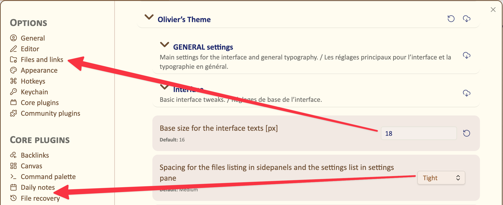
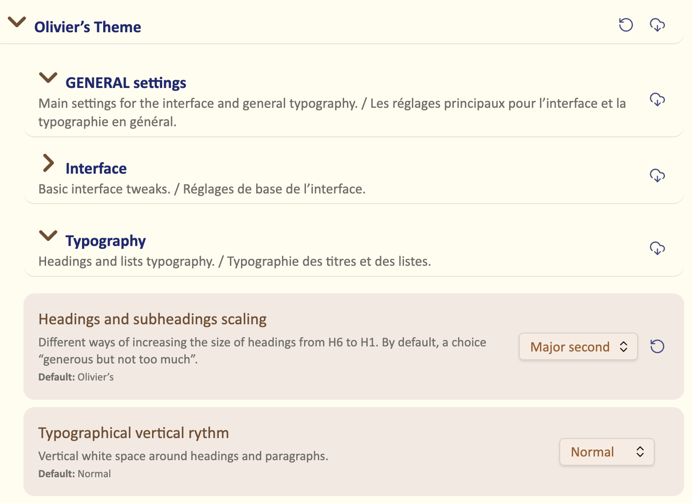

# Olivier’s Theme 3.0 ⬩ User Guide

Olivier’s Theme is an Obsidian theme built for legibility, calm colour palettes, and a deliberate separation between reading and writing.

It provides a coherent typographic and colour system for the whole application, while leaving room for precise adjustments: global workspace settings, dedicated Reading and Writing environments, and note-level cssclasses.

This guide explains how to configure the theme efficiently. It assumes that you already know the basics of Obsidian and want to shape a workspace that supports sustained reading, structured thinking, and focused writing.

## What makes Olivier’s Theme distinctive

Olivier’s Theme is designed for people who spend substantial time thinking, reading, writing, and organising material in Obsidian.

It treats the application as two connected environments:

- a **reading space**, designed to feel calm, legible, and typographically coherent;
- a **writing space**, designed to remain practical, structured, and adaptable while you edit.

The theme does not try to make every part of Obsidian look identical. Instead, it gives Reading mode and Writing mode their own visual logic, while keeping the workspace recognisable and consistent.

### Typography before decoration

Typography is the main organising principle of the theme.

Text size, line length, line height, heading scale, list spacing, indentation, table width, and vertical rhythm can all be adjusted independently. The aim is not to make notes look ornate, but to make long notes easier to read, scan, and write.

Reading mode can feel like a carefully set page. Writing mode can remain denser, more technical, or more personal, without compromising the appearance of the finished note.

For a closer look at this distinction, see [Reading vs. Writing — mental modes](reading-vs-writing.md).

### A colour system, not isolated palettes

The theme uses a structured OKLCH-based colour system to keep backgrounds, text, accents, interface states, and semantic colours visually related.

Light mode and dark mode can use different palettes. Most palettes also let you adjust their intensity, so you can move from a quiet, nearly neutral interface to a more expressive one without losing the theme’s internal balance.

The result is not simply a collection of colour schemes: it is a system intended to keep the workspace legible and coherent across panes, tabs, controls, notes, code blocks, tables, and plugins.

### Global settings, local exceptions

Most choices can be made globally through Style Settings: interface density, typography, colors, Reading mode, Writing mode, and Kanban presentation.

When one note needs a different treatment, you do not have to change the whole vault. Theme-specific `cssclasses` let you make controlled local adjustments, such as:

- widening the text column, tables, Bases, or images;
- changing the appearance of tables or horizontal rules;
- adjusting image size and alignment;
- changing Reading mode text size for a single note;
- showing or hiding Base headers in Reading mode.

This makes it possible to keep a coherent default environment while accommodating dashboards, long-form notes, image-heavy pages, reference sheets, and specialised layouts.

See the [CSS classes reference](css-classes.md) for the complete list.

### A colour system, not isolated palettes

The theme uses a structured OKLCH-based colour system to keep backgrounds, text, accents, interface states, and semantic colours visually related.

Light mode and dark mode can use different palettes. Most palettes also let you adjust their intensity, so you can move from a quiet, nearly neutral interface to a more expressive one without losing the theme’s internal balance.

The result is not simply a collection of colour schemes: it is a system intended to keep the workspace legible and coherent across panes, tabs, controls, notes, code blocks, tables, and plugins.

### Global settings, local exceptions

Most choices can be made globally through Style Settings: interface density, typography, colors, Reading mode, Writing mode, and Kanban presentation.

When one note needs a different treatment, you do not have to change the whole vault. Theme-specific `cssclasses` let you make controlled local adjustments, such as:

- widening the text column, tables, Bases, or images;
- changing the appearance of tables or horizontal rules;
- adjusting image size and alignment;
- changing Reading mode text size for a single note;
- showing or hiding Base headers in Reading mode.

This makes it possible to keep a coherent default environment while accommodating dashboards, long-form notes, image-heavy pages, reference sheets, and specialised layouts.

See the [CSS classes reference](css-classes.md) for the complete list.

______________________________________________________________________

## Before you start

To use all the options described here, you need:

- [Obsidian](https://obsidian.md/) 1.5 or later.
- [Olivier’s Theme](https://github.com/OlivierPS/Olivier-s-Theme) installed and active.
- The **[Style Settings](obsidian://show-plugin?id=obsidian-style-settings)** plugin enabled.

All theme settings are located under **Settings → Appearance → Style Settings → Olivier’s Theme**.

If some Obsidian terms feel unclear, see the [Glossary](glossary.md).

______________________________________________________________________

The guide covers the theme’s Style Settings and its note-level cssclasses.

## How to use this guide

You do not need to read everything in order.

- Go to **[Interface](interface.md)** to adjust the workspace, sidebars, tabs, Properties, embeds, and Canvas.
- Go to **[General](general.md)** for typography and Kanban settings.
- Go to **[Light mode colors](light-mode-colors.md)** to choose a palette for light mode.
- Go to **[Dark mode colors](dark-mode-colors.md)** if you want a different palette in dark mode.
- Go to **[Reading mode](reading-mode.md)** for a more book-like reading experience.
- Go to **[Writing mode](writing-mode.md)** to tune your editing environment.
- Go to **[CSS classes reference](css-classes.md)** for the full list of available cssclasses.
- Go to **[Niceties & cssclasses guide](niceties-and-cssclasses.md)** to learn how to use cssclasses in practice and apply note-level refinements.
- Go to the [Glossary](glossary.md) for definitions of key Obsidian terms used in this guide.

## If you want to…

- Make the interface larger, denser, or easier to navigate: start with [Interface](interface.md).
- Adjust headings, vertical spacing, separators, lists, or Kanban boards: see [General](general.md).
- Choose the overall color atmosphere of the theme: see [Light mode colors](light-mode-colors.md) and [Dark mode colors](dark-mode-colors.md).
- Fine-tune links, highlights, and inline text colors: see [Text colors](text-colors.md).
- Improve long-form reading comfort: see [Reading mode](reading-mode.md).
- Improve writing comfort in Live Preview or Source mode: see [Writing mode](writing-mode.md).
- See the full list of available cssclasses: see [CSS classes reference](css-classes.md).
- Learn how to use cssclasses for note-level tweaks or special layouts: see [Niceties & cssclasses guide](niceties-and-cssclasses.md).

## Quick path ⬩ 5-minute setup

The default settings stay close to standard Obsidian. A few adjustments can make the theme much more comfortable on your current screen.

This section only covers the settings that usually make the biggest difference first. For full explanations, use the detailed pages.

### 1. Adjust the interface

Open **GENERAL settings > Interface** and start with:

- “Base size for the interface texts (px)”
- “Spacing for items in sidepanels and settings panel”

These two settings already change how comfortable the whole interface feels in everyday use.

### 2. Adjust the main typography

Open **GENERAL settings > Typography** and start with:

- Heading scaling, to control the visual hierarchy from H1 to H6.
- Vertical rhythm, to make the text feel tighter or more spacious.

### 3. Choose your color palette

Pick a palette in **Light mode colors**.

In most cases, this is the most effective way to give the theme its overall atmosphere. If needed, you can then choose a different palette for dark mode.

### 4. Improve reading comfort

Open **READING mode** and focus first on:

- Body text size
- Line height
- Line length

These three settings define most of the reading experience. If you often work with tables or Bases, you may also want to adjust their presentation.

### 5. Improve writing comfort

Open **WRITING mode** and adjust the main text settings so editing feels as comfortable as reading.

If you mainly write in Live Preview, focus on the options that affect text size, spacing, and visual calm while editing.

### 6. Add note-level refinements when needed

Once the global settings feel right, you can use cssclasses for special cases.

This is useful for notes that need a different layout, a cleaner look, or specific visual adjustments without changing the whole theme.

[^oklch]: OKLCH means “ok Lightness Chroma Hue”. It’s a CSS color system designed to handle colors in a way similar to human perception. It’s inspired by the [Munsell color system](https://en.wikipedia.org/wiki/Munsell_color_system).
