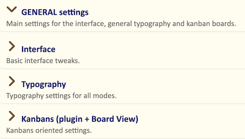
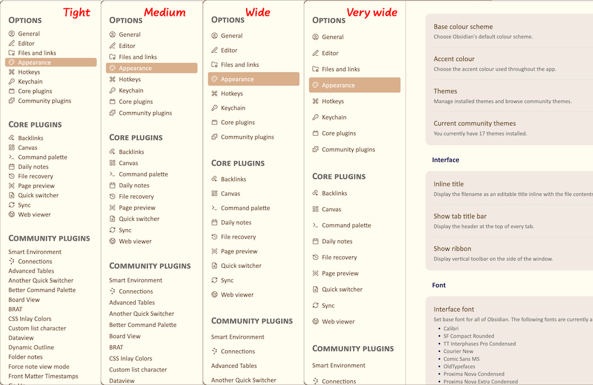
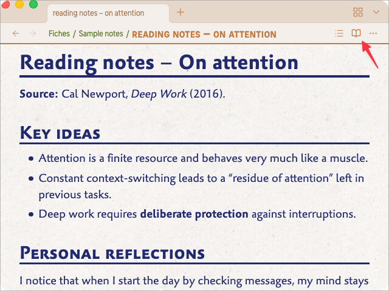
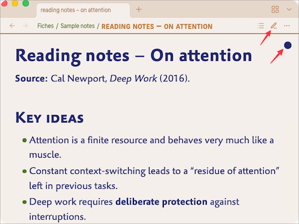
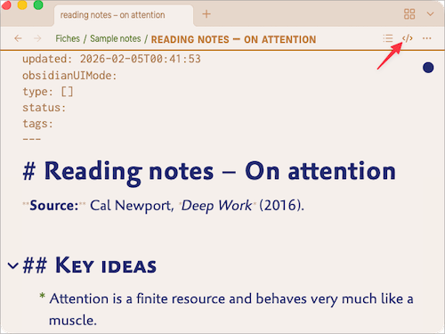
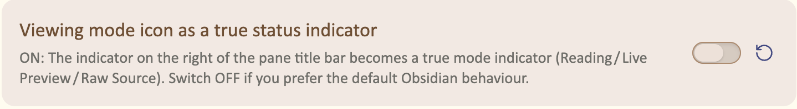

# Interface

Open **Settings → Appearance → Style Settings → Olivier’s Theme → GENERAL settings → Interface**.

These settings adjust the global Obsidian interface: its size, density, navigation cues, structural elements, and a few display details. They affect the workspace rather than the typography of your notes.

If needed, see the [Glossary](glossary.md) for short explanations of panes, tabs, sidebars, status bar, Canvas, Properties, and embeds.

## Interface text size

### Base size for the interface texts (px)

This setting defines the base text size for most interface elements, including:

- file and folder names in the sidebars
- status bar items
- tab titles
- text in modal dialogs, such as Settings and the command palette

The default is **18 px**, slightly bigger than Obsidian’s default.

If the interface feels too small or too large on your screen, adjust this setting first. Because many interface elements derive from this value, it scales much of the workspace consistently.

> Tip: To see which parts of the interface are affected, temporarily choose a distinctive interface font in `Settings → Appearance → Fonts → Interface font`, such as Courier.

### Reduce interface elements in sidebars

This option uses a smaller interface text size for selected elements displayed in the sidebars.

Enable it if you use narrow sidebars, keep many panes open, or prefer a denser workspace. Leave it off if sidebar text is already close to your comfortable reading size.

It complements, rather than replaces, **Base size for the interface texts**: use the base size to set the overall interface scale, then enable this option only when sidebars need to be more compact.

## Sidebar density

### Spacing for items in sidepanels and settings panel

This option controls the vertical spacing of file rows in the sidebars, along with some lists in the Settings panel.

Choose one of four presets:

- **Tight** — compact rows; useful when you want to see more files and folders at once.
- **Medium** — the default balance for most screens.
- **Wide** — more breathing room between items.
- **Very wide** — a spacious layout, especially comfortable on large screens.

The setting changes row spacing, not the interface font size. Combine it with **Base size for the interface texts** to tune both density and legibility.

## Tabs and pane controls

### Viewing mode icon as a true status indicator

This option makes the icon at the right of a pane’s title bar show the current mode.

When enabled:

- an **open book** indicates Reading mode  
  

- a **pencil**, with a small dot in its upper-right corner, indicates Live Preview  
  

- a **symbol**, with the same dot, indicates Source mode  
  

The dot distinguishes editable modes from Reading mode. Turn the option off if you prefer Obsidian’s standard icon behaviour.

### Highlight current tab

Enable this option to give the active tab more visual emphasis.

It is most useful when several tabs are open in the same pane, when tabs are stacked, or when you work with several panes at once. It does not change the tab layout; it only makes the current tab easier to identify.

### Hide Title Bar breadcrumb

Obsidian can display a breadcrumb in the title bar, showing the vault name, the current note, or the active plugin view.

Enable this option to hide that breadcrumb while keeping the rest of the title bar unchanged. It is useful when the information is redundant or makes the interface feel visually busy.

## Properties, embeds, and lightbox

### Width of the properties labels (em)

This setting controls the width of the label column in Properties.

Increase the value when your property names are long and wrap or are cropped. Reduce it to preserve horizontal space in a narrow Properties sidebar.

The value uses `em` units, so it scales with the interface text size.

### Hide embed titles

Embedded notes and queries normally display their file name above their content.

This option hides that title, leaving only the embedded content visible. It is enabled by default because the file name is often unnecessary and visually distracting.

Turn it off when embedded notes need an explicit visible title.

### Hide lightbox file name

When you open an image in Obsidian’s lightbox, its file name normally appears in a bar at the top.

Enable this option to hide that bar globally. The image then occupies the visual focus without a file-name label.

To hide the bar in selected notes only, use the `OT-lightbox-hide-titlebar` class described in the [CSS classes reference](css-classes.md).

## Window and Canvas

### Status Bar padding (px)

This setting controls the space between the status bar and the right and bottom edges of the application window.

- **0** keeps the status bar flush with the window edge and saves a little space.
- Higher values add visual breathing room.

Use a small value if you prefer a slightly less cramped window edge. Use `0` for the most compact layout.

### Hide canvas dot pattern

Canvas uses a subtle dotted background by default.

Enable this option to replace it with a plain background. This can make large or complex canvases feel calmer and less visually busy.

Leave it off if you use the dots as a visual alignment aid.