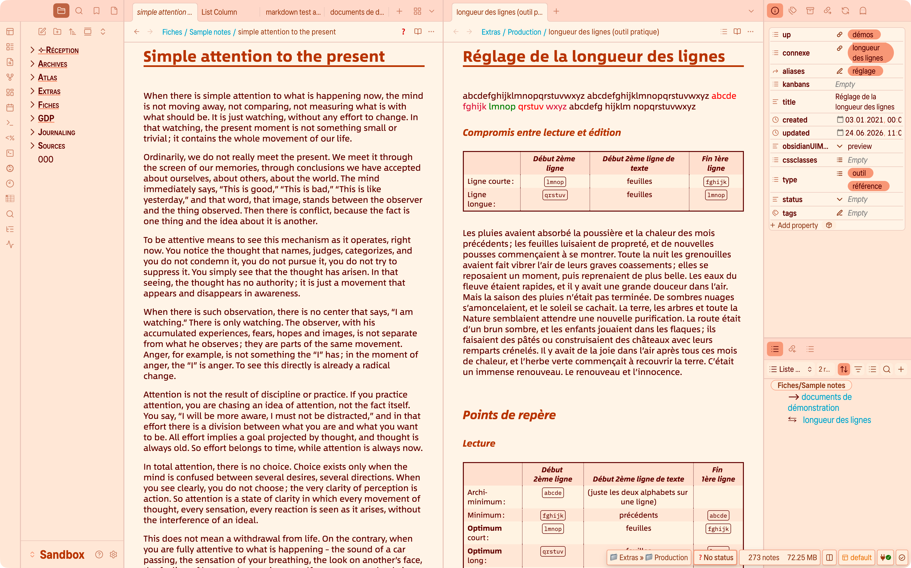

# Palette descriptions

This page does not explain the color settings themselves. Instead, it describes the visual philosophy of each palette and suggests the kinds of notes, moods, and workflows for which it may feel most appropriate.

Some palettes are discreet and neutral, others more atmospheric or expressive. Version 3 also introduces a wider and more flexible color logic, including palettes with adjustable intensity and one palette built to explore the whole hue range across the full color wheel.

Use this page as a companion to the **[Light mode colors](light-mode-colors.md)** and **[Dark mode colors](dark-mode-colors.md)** guides: those pages explain *how* to choose a palette, while this page helps you decide *which one* may suit you best.

## How palettes work

The philosophy of Olivier’s Theme calls for your choosing a palette for **Light mode**. This is the simplest way to define the overall identity of your vault.

Then, for **Dark mode**, you have two possibilities:

- leave the theme on its default behaviour, in which case it automatically applies a related Dark palette;
- choose a specific Dark palette manually, if you want a different mood at night.

This means that Light and Dark mode can either remain closely related or become completely independent — the choice is yours.

## Two important sliders

Two sliders are especially important in version 3: **Main color** and **Color intensity**.

The **Main color** slider works **only** with the **Custom** palette. It has no effect on the other palettes. This is important enough to repeat: if you are not using the Custom palette, the **Main color** slider does nothing.

The **Color intensity** slider is broader in scope, but it does **not** have exactly the same effect in every palette. In some palettes, it strongly changes the atmosphere; in others, it only makes a subtle difference. This page points out those differences where they matter.

## The Custom palette

The **Custom** palette is available in both Light and Dark mode.

It is the most flexible palette in the theme. It is designed for users who want direct control over the main hue and who enjoy exploring a wider range of visual identities than the predefined palettes offer.

With the Custom palette:

- the **Main color** slider is active and lets you travel across the full 360° hue range;
- the **Color intensity** slider lets you decide how discreet or how pronounced the resulting atmosphere should be.

The **Main color** slider moves in steps of 4 units by design.

This makes the control easier to use and easier to reproduce. Smaller steps would often be too subtle to notice clearly, while making the slider more fiddly in everyday use.

Custom is especially useful if you:

- want a very personal vault identity;
- need a hue that is not covered by the predefined palettes;
- like to fine-tune color while staying within the visual logic of the theme.

### Example: an “autumn ink” Custom palette

The screenshot below shows a Custom palette configured with:

- **Main color** set to a red-brown hue (40);
- **Color intensity** set to a medium value (47).

This creates a warm, slightly literary atmosphere, closer to fountain-pen ink on paper than to a standard UI accent color.

## Light-mode palettes

The Light-mode palettes define the daytime atmosphere of the theme. Some are quiet and almost paper-like, some are more colourful, and some are inspired by familiar visual traditions or well-known systems.

In general, Light-mode palettes influence not only the accent color, but also the wider color relationship of the interface: text, surfaces, backgrounds, highlighting, and the corresponding Dark-mode default.

### Palette families

This section can group the Light palettes into a few meaningful families. The exact classification can be refined later, but the goal is simple: help users understand the spirit of each palette before they look at individual examples.

Possible distinctions include:

- discreet or neutral palettes;
- more atmospheric palettes;
- classic-inspired palettes;
- more exploratory palettes with broader color range.

### Color intensity in Light mode

In Light mode, the **Color intensity** slider does not behave like a simple “more or less saturation” control.

A useful rule of thumb is this: **50 is the natural midpoint** of a palette. Around that value, the palette keeps the balance it was designed to have. Below 50, hues are softened and the atmosphere becomes calmer and more muted. Above 50, the same palette shows more of its colour character and feels more assertive.

Some palettes respond strongly, others more gently, and a few remain almost unchanged by design.

Several palettes also keep the background of content panels relatively stable across the slider range. This preserves readability and avoids making the whole interface feel too busy. As a result, it is normal for some parts of the UI to react more strongly than others.

The table below summarises how the slider generally feels for the main Light-mode palettes.

| Palette       | Effect of **Color intensity**                                | Content panels                                            |
| ------------- | ------------------------------------------------------------ | --------------------------------------------------------- |
| Custom        | Strong response. Below 50, the palette becomes quieter and more neutral; above 50, the chosen hue becomes much more present across the interface. | Usually follows the general palette logic.                |
| OBSIDIAN      | No significant visible response. The palette stays close to its neutral baseline across the range. | Unchanged.                                                |
| Art Deco      | Moderate response. The palette keeps its decorative character, while the slider makes it either more discreet or more assertive. | Usually more restrained than accents and surrounding UI.  |
| Beige         | Moderate response. The palette moves from very soft beige to a richer, warmer atmosphere without becoming loud. | Mostly stable, with only subtle shifts.                   |
| Blue          | Noticeable response. Lower values feel calmer and more classical; higher values bring a clearer cool tint to the vault. | Often more stable than the overall atmosphere.            |
| Green         | Noticeable response. The palette moves from soft and natural to fresher and more vivid. | Can stay slightly calmer than the global atmosphere.      |
| CRT 80s Amber | Strong response. Higher values make the retro terminal mood much more pronounced. | Usually more restrained than the surrounding atmosphere.  |
| CRT 80s Green | Strong response. The monochrome CRT identity becomes more vivid and unmistakable as intensity rises. | Generally stable enough for readability.                  |
| Icy           | Moderate to noticeable response. The palette moves from discreet coolness to a clearer icy identity. | Usually changes more gently than the overall atmosphere.  |
| Ideaverse     | Gentle response. The palette keeps its recognisable identity, while the slider mainly adjusts how strongly it is expressed. | Mostly unchanged.                                         |
| Metallic Blue | Noticeable response. Higher values make the palette more assertive and more technical. | Usually more restrained than the global tint.             |
| Ivory         | Moderate response. The palette remains soft and paper-like, while warmth and colour presence vary around that base. | Kept deliberately stable to preserve the paper-like feel. |
| Orange        | Strong response. At low values it stays gently warm; at high values it becomes clearly more expressive. | Less affected than accents and UI.                        |
| Paradiso      | Noticeable response. Lower values feel calm; higher values make the palette brighter and more luminous. | Usually changes more softly than the overall atmosphere.  |
| Pistachio     | Noticeable response. The palette becomes fresher and more playful as intensity rises. | Often subtler on panel backgrounds.                       |
| Parchment     | Moderate response. The atmosphere shifts, but the underlying paper-like feel remains consistent. | Mostly stable, with only gentle shifts.                   |
| Red           | Strong response. Higher values give the palette a more distinct and characterful presence. | Usually more restrained than accents.                     |
| Solarized     | Gentle to moderate response. The familiar Solarized balance remains, while the slider adjusts how present the colours feel. | Largely stable.                                           |
| Stone         | No significant visible response. The palette is intentionally restrained and stays nearly constant across the range. | Unchanged.                                                |
| Sunny Memos   | Moderate to noticeable response. The palette becomes more cheerful and sunlit as intensity rises. | Usually fairly stable.                                    |
| Violet        | Strong response. Higher values make the palette more expressive, while lower values keep it calmer. | Usually less affected than the global tint.               |
| Yellow        | Strong response. The palette moves from a soft warm presence to a more vivid and energetic atmosphere. | Often more stable than the overall mood.                  |

## Dark-mode palettes

Dark-mode palettes define the nighttime atmosphere of the theme.

Some of them are direct dark counterparts to Light-mode palettes; others are more autonomous and create a distinct mood of their own. In both cases, they shape much more than the accent colour: they influence backgrounds, panel tones, contrast, highlights, and the overall feel of the interface after dark.

### Color intensity in Dark mode

In Dark mode, the **Color intensity** slider follows the same broad logic as in Light mode, but the result often feels more atmospheric.

A useful rule of thumb is this: **50 is the natural midpoint** of a palette. Around that value, the palette keeps the balance it was designed to have. Below 50, hues are softened and the overall mood becomes quieter or more neutral. Above 50, the same palette becomes more present and more characterful.

Some palettes respond strongly, others more gently, and a few remain almost unchanged by design.

As in Light mode, some palettes keep the background of content panels relatively stable even when the surrounding atmosphere changes. This helps preserve contrast, legibility, and visual comfort during longer reading or writing sessions.

The table below summarises how the slider generally feels for the main Dark-mode palettes.

| Palette       | Effect of **Color intensity**                                | Content panels                                               |
| ------------- | ------------------------------------------------------------ | ------------------------------------------------------------ |
| Custom        | Strong response. Below 50, the palette becomes quieter and more subdued; above 50, the chosen hue becomes much more present across the interface. | Usually follows the general palette logic.                   |
| Art Deco      | Moderate response. The palette keeps its stylised character, while the slider makes it either more discreet or more theatrical. | Usually more restrained than accents and surrounding chrome. |
| Beige         | Gentle response. The palette remains soft and warm, while the slider mainly adjusts how tinted the dark surfaces feel. | Mostly stable.                                               |
| Black         | No significant visible response. The palette is intentionally achromatic. | Unchanged.                                                   |
| Blue          | Noticeable response. Lower values feel calmer and more neutral; higher values bring a clearer cool cast to the interface. | Often more stable than the overall atmosphere.               |
| Metallic Blue | Noticeable response. Higher values make the palette more assertive and more technical. | Usually more restrained than the global tint.                |
| Brown         | Moderate response. The palette moves from quiet warmth to a more present sepia-like atmosphere. | Mostly stable, with subtle shifts.                           |
| CRT 80s Amber | Strong response. Higher values make the retro terminal mood much more pronounced. | Usually kept more restrained for visual comfort.             |
| CRT 80s Green | Strong response. The monochrome CRT identity becomes more vivid and unmistakable as intensity rises. | Generally stable enough for readability.                     |
| Green         | Noticeable response. The palette moves from calm and natural to more vivid and energetic. | Slightly more restrained than accents and interface tint.    |
| Icy           | Moderate to noticeable response. The palette becomes more sharply cool and nocturnal as intensity rises. | Usually changes more gently than the overall atmosphere.     |
| Ideaverse     | Gentle response. The palette keeps its recognisable identity, while the slider mainly adjusts how strongly it is expressed. | Mostly unchanged.                                            |
| LYT           | Moderate response. The palette keeps its own dark personality, while the slider changes how clearly its hues come forward. | Usually stable enough for comfortable reading.               |
| OBSIDIAN      | No significant visible response. The palette stays close to a neutral dark baseline across the range. | Unchanged.                                                   |
| Orange        | Strong response. At low values it feels like a quiet ember; at high values it becomes clearly more expressive. | Less affected than accents and UI glow.                      |
| Parchment     | Moderate response. The palette keeps its softened, paper-like darkness while colour presence rises or falls around it. | Mostly stable.                                               |
| Red           | Strong response. Higher values make the palette deeper, more dramatic, and more characterful. | Usually more restrained than accents.                        |
| Solarized     | Gentle to moderate response. The familiar Solarized balance remains, while the slider adjusts how present the palette feels. | Largely stable.                                              |
| Stone         | No significant visible response. The palette is intentionally quiet and remains very close to its designed balance. | Unchanged.                                                   |
| Violet        | Strong response. Higher values make the palette more atmospheric and expressive, while lower values keep it calmer. | Usually less affected than the global tint.                  |
| Yellow        | Strong response. The palette moves from a discreet warm glow to a brighter, more energetic night atmosphere. | Often more stable than the overall mood.                     |

### Default Dark-mode counterparts

When **Dark palette** is set to **Default**, Olivier’s Theme automatically chooses the dark counterpart that best matches the selected Light-mode palette.

In many cases, the correspondence is direct: a Light palette simply continues into its own Dark-mode version. In a few cases, however, several Light-mode palettes converge toward the same Dark palette. This is intentional.

The table below summarises the default correspondence.

| Light-mode palette   | Default Dark-mode counterpart | Notes                                                        |
| -------------------- | ----------------------------- | ------------------------------------------------------------ |
| Default for Obsidian | Default for Obsidian          | Direct counterpart.                                          |
| Art déco             | Art déco                      | Shares a dark neutral base rather than reproducing the decorative warmth literally. |
| Beige                | Beige                         | The dark version keeps the warm family feeling, but shifts toward a richer sepia-like atmosphere. |
| Blue                 | Blue                          | Direct counterpart.                                          |
| Green                | Green                         | Direct counterpart.                                          |
| CRT 80s Amber        | CRT 80s Amber                 | Direct counterpart.                                          |
| CRT 80s Green        | CRT 80s Green                 | Direct counterpart.                                          |
| Icy                  | Icy                           | Direct counterpart.                                          |
| Ideaverse            | Ideaverse                     | Direct counterpart.                                          |
| Ivory                | Yellow                        | Converges toward a softer warm dark palette rather than a literal “ivory at night” translation. |
| Metallic Blue        | Metallic Blue                 | Direct counterpart.                                          |
| Orange               | Orange                        | Direct counterpart.                                          |
| Paradiso             | Green                         | Converges toward the same dark family as other green-based palettes. |
| Pistachio            | Green                         | Shares the same default dark destination as Paradiso, for a cleaner and more coherent dark rendering. |
| Parchment            | Parchment                     | Direct counterpart.                                          |
| Red                  | Red                           | Direct counterpart.                                          |
| Solarized            | Solarized                     | Direct counterpart.                                          |
| Stone                | Stone                         | Direct counterpart.                                          |
| Sunny Memos          | Yellow                        | Converges toward a warm dark palette that preserves softness without becoming harsh. |
| Violet               | Violet                        | Direct counterpart.                                          |
| Yellow               | Yellow                        | Direct counterpart.                                          |

