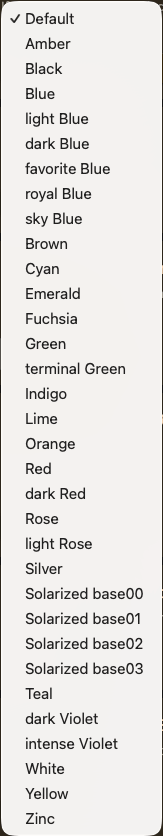

# Text colors

Wherever there is the possibility to choose a text color, you have the same large selection :

Not every color is suitable for every background —  that’s  why you have so many options. All these colors are available for text

* in Reading and in Editing / Writing modes

* in Light mode and in Dark mode.

  

With a wide choice of colours and papers for the background too, you should be able to find more than one combination that suits your preferences and intended use, whether for reading or writing, in both light mode and dark mode.

On the following screenshots, you’ll see different ideas for inspiration. The left side of the window shows a note in Editing mode, and the right side shows the same note in Reading mode.

###### First capture — The default

By leaving all the choices at their “default” settings, you will have an experience where the two modes – Editing and Reading – are very similar :

